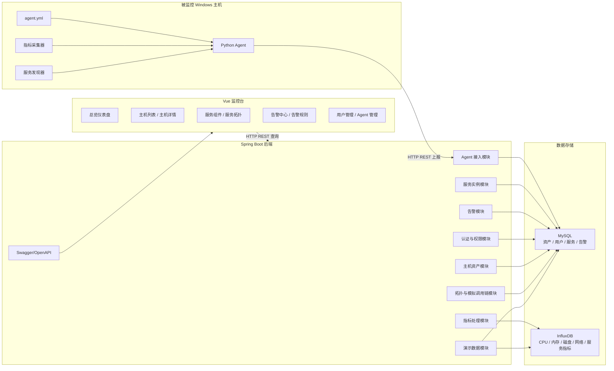
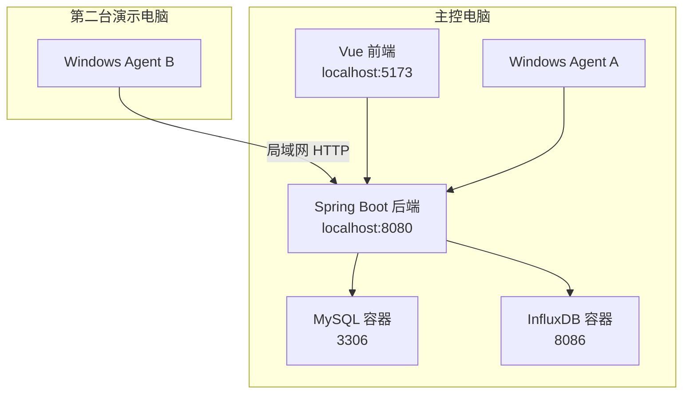
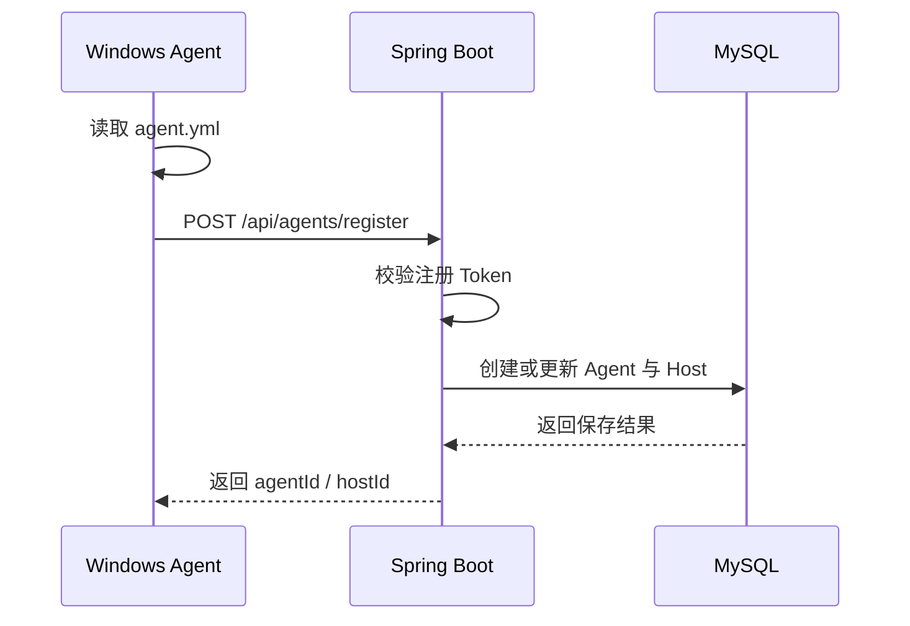
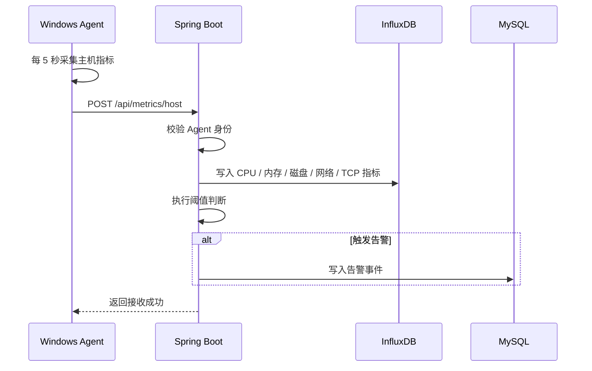
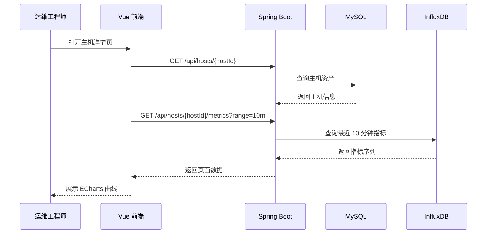
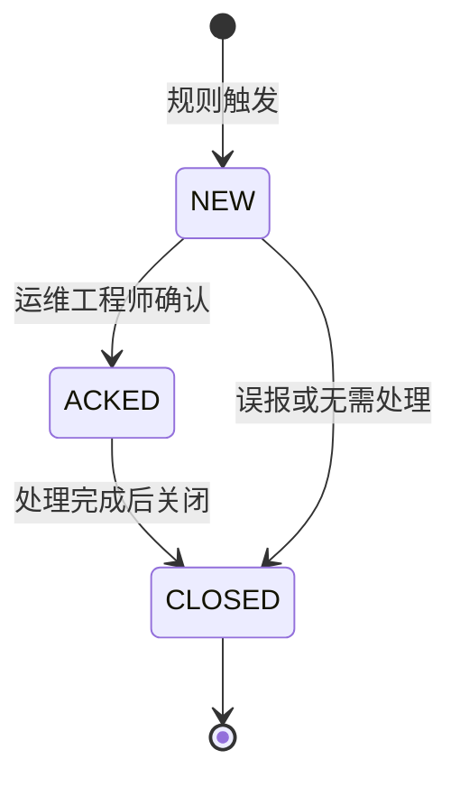

# AegisMonitor 概要设计说明书

## 1. 设计目标

AegisMonitor 的概要设计目标是将需求阶段确认的监控平台能力转化为清晰的系统结构、模块边界、数据流和部署方案，为后续详细设计与编码提供依据。

本系统定位为课程设计级可运行演示系统，采用生产级监控平台的设计思想。系统重点保证以下闭环：

1. Agent 接入主机。
2. Agent 采集主机和服务数据。
3. 后端接收并存储数据。
4. 前端展示监控状态。
5. 告警规则触发告警事件。
6. 运维人员确认和关闭告警。

## 2. 总体架构

系统采用前后端分离、Agent 主动上报、关系型数据与时序指标数据分离的架构。

## 3. 部署架构

MVP 演示环境使用 2 台真实 Windows 主机和 3 台模拟主机数据。数据库由 Docker Compose 启动，后端、前端和 Agent 本地运行。

部署策略：

- MySQL 和 InfluxDB 使用 Docker Compose。
- Spring Boot 后端本地启动。
- Vue 前端本地启动。
- Agent 在 Windows 主机上运行。
- 如果第二台主机无法连接，使用模拟主机数据兜底。

## 4. 模块划分

### 4.1 Agent 模块

职责：

- 读取本地配置。
- 注册主机。
- 定时上报心跳。
- 采集主机指标。
- 识别服务组件。
- 上报服务指标。

内部子模块：

| 子模块 | 职责 |
| --- | --- |
| ConfigLoader | 读取 agent.yml |
| RegisterClient | 调用 Agent 注册接口 |
| HeartbeatReporter | 定时发送心跳 |
| HostInfoCollector | 采集主机基础信息 |
| HostMetricCollector | 采集 CPU、内存、磁盘、网络、TCP |
| ServiceDiscovery | 识别 Java、MySQL、Redis、Nginx、Node.js |
| ServiceMetricCollector | 采集服务进程指标 |
| HttpReporter | 封装 HTTP 上报 |

### 4.2 后端模块

| 模块 | 职责 |
| --- | --- |
| Auth 模块 | 用户登录、JWT 签发、角色权限校验 |
| Agent 模块 | 注册 Token 校验、Agent 注册、心跳、在线状态 |
| Host 模块 | 主机资产、分组、标签、详情查询 |
| Metric 模块 | 指标接收、InfluxDB 写入、指标查询 |
| Service 模块 | 服务实例保存、服务指标查询、服务状态判断 |
| Alert 模块 | 告警规则、告警事件、ACK、关闭 |
| Topology 模块 | 服务拓扑、模拟调用链 |
| Demo 模块 | 模拟主机、模拟指标、模拟告警生成 |
| OpenAPI 模块 | Swagger UI 接口文档 |

### 4.3 前端模块

| 模块 | 职责 |
| --- | --- |
| 登录模块 | 用户登录、Token 保存 |
| 布局模块 | 侧边栏、顶部栏、路由出口 |
| 仪表盘模块 | 展示全局监控概览 |
| 主机模块 | 主机列表、主机详情、指标曲线 |
| 服务模块 | 服务组件列表、服务详情 |
| 拓扑模块 | 服务拓扑与模拟调用链 |
| 告警模块 | 告警规则、告警中心、ACK 和关闭 |
| 管理模块 | Agent 管理、用户管理基础页 |

## 5. 数据流设计

### 5.1 Agent 注册流

### 5.2 指标上报流

### 5.3 前端查询流

### 5.4 告警处理流

## 6. 权限设计

系统采用 RBAC。

| 角色 | MVP 实现 | 权限 |
| --- | --- | --- |
| SYSTEM_ADMIN | 是 | 用户管理、Agent 管理、查看所有数据、管理规则 |
| OPS_ENGINEER | 是 | 查看监控数据、管理告警规则、ACK 和关闭告警 |
| DEVELOPER_READONLY | 否，文档设计 | 只读查看授权应用和主机 |

认证方式：

- 用户登录使用 JWT。
- Agent 接入使用 Agent 注册 Token。
- 用户认证和 Agent 认证分离。

## 7. 存储设计概要

MySQL 存储低频、关系型、状态型数据：

- 用户。
- 角色。
- Agent。
- 主机。
- 服务实例。
- 告警规则。
- 告警事件。
- 系统配置。

InfluxDB 存储高频、时间序列指标：

- CPU 指标。
- 内存指标。
- 磁盘指标。
- 网络指标。
- TCP 指标。
- 服务进程指标。

## 8. 接口分组概要

| 分组 | 路径前缀 | 说明 |
| --- | --- | --- |
| 认证接口 | /api/auth | 登录、用户信息 |
| Agent 接口 | /api/agents | 注册、心跳、Agent 管理 |
| 主机接口 | /api/hosts | 主机列表、详情、分组标签 |
| 指标接口 | /api/metrics | 指标上报和查询 |
| 服务接口 | /api/services | 服务发现、服务指标、服务列表 |
| 告警接口 | /api/alerts | 告警规则、事件、ACK、关闭 |
| 拓扑接口 | /api/topology | 服务拓扑和模拟调用链 |
| 演示接口 | /api/demo | 模拟数据生成 |
| 用户接口 | /api/users | 用户管理 |

## 9. 关键设计取舍

| 设计点 | 当前选择 | 原因 |
| --- | --- | --- |
| 架构 | 模块化单体 | 控制复杂度，便于课程演示 |
| 指标存储 | InfluxDB | 符合时间序列数据特点 |
| 资产存储 | MySQL | 符合关系型数据特点 |
| 数据刷新 | 前端定时轮询 | 简单稳定，满足 5 秒级演示 |
| 调用链 | 模拟调用链 | 避免完整 Trace 超范围 |
| Agent 配置 | 本地配置文件 | 避免远程配置下发复杂度 |
| 真实主机数量 | 2 台真实 + 3 台模拟 | 满足题目硬件要求并保证演示效果 |

## 10. 后续详细设计重点

后续详细设计应继续展开：

- Agent 采集器类设计。
- 服务识别规则。
- MySQL 表结构和字段。
- InfluxDB measurement、tag、field。
- REST API 请求和响应结构。
- 告警规则判断算法。
- 前端路由和组件结构。
- 测试用例与异常场景。

