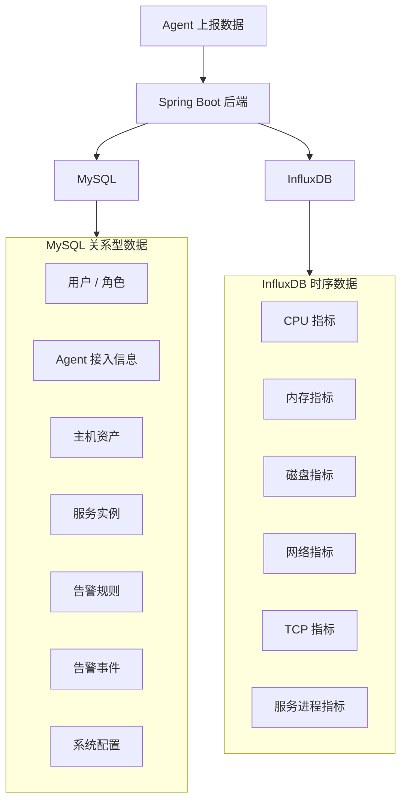
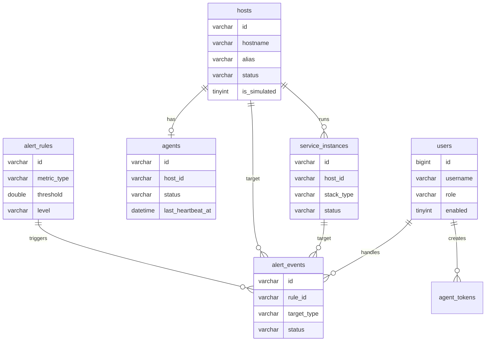

# AegisMonitor 数据模型原型

## 1. 设计目标

本文件定义 AegisMonitor 的数据模型原型，包括 MySQL 关系型数据表和 InfluxDB 时序指标模型。后续详细设计和编码可在此基础上补充字段类型、索引、约束和初始化脚本。

设计目标：

- MySQL 存储资产、用户、配置、服务和告警等关系型数据。
- InfluxDB 存储 CPU、内存、磁盘、网络、TCP 和服务进程等高频时序指标。
- 数据模型支持 2 台真实主机和 3 台模拟主机的课程演示。
- 数据模型支持告警规则判断和告警处理闭环。

## 2. 数据分层

## 3. MySQL 表原型

### 3.1 users 用户表

用途：存储登录用户和角色。

| 字段 | 类型建议 | 说明 |
| --- | --- | --- |
| id | BIGINT | 主键 |
| username | VARCHAR(64) | 登录名，唯一 |
| password_hash | VARCHAR(255) | BCrypt 哈希后的密码 |
| display_name | VARCHAR(64) | 展示名称 |
| role | VARCHAR(32) | SYSTEM_ADMIN / OPS_ENGINEER / DEVELOPER_READONLY |
| enabled | TINYINT | 是否启用 |
| created_at | DATETIME | 创建时间 |
| updated_at | DATETIME | 更新时间 |

初始数据：

- `admin / SYSTEM_ADMIN`
- `ops01 / OPS_ENGINEER`

### 3.2 agent_tokens 注册 Token 表

用途：管理 Agent 注册 Token。

| 字段 | 类型建议 | 说明 |
| --- | --- | --- |
| id | BIGINT | 主键 |
| token_name | VARCHAR(64) | Token 名称 |
| token_hash | VARCHAR(255) | Token 哈希值 |
| enabled | TINYINT | 是否启用 |
| expires_at | DATETIME | 过期时间，可为空 |
| created_by | BIGINT | 创建人 |
| created_at | DATETIME | 创建时间 |

MVP 可简化：

- 使用一个默认演示 Token。
- 前端 Agent 管理页展示 Token 摘要。

### 3.3 agents Agent 表

用途：记录 Agent 接入信息和运行状态。

| 字段 | 类型建议 | 说明 |
| --- | --- | --- |
| id | VARCHAR(64) | Agent ID |
| host_id | VARCHAR(64) | 所属主机 ID |
| agent_secret_hash | VARCHAR(255) | Agent Secret 哈希 |
| agent_version | VARCHAR(32) | Agent 版本 |
| status | VARCHAR(32) | ONLINE / OFFLINE / PENDING |
| last_heartbeat_at | DATETIME | 最近心跳时间 |
| config_summary | JSON | Agent 配置摘要 |
| approved | TINYINT | 是否审批通过 |
| created_at | DATETIME | 创建时间 |
| updated_at | DATETIME | 更新时间 |

### 3.4 hosts 主机资产表

用途：存储被监控主机的基础信息和分组标签。

| 字段 | 类型建议 | 说明 |
| --- | --- | --- |
| id | VARCHAR(64) | Host ID |
| hostname | VARCHAR(128) | 主机名 |
| alias | VARCHAR(128) | 主机别名 |
| ip_address | VARCHAR(64) | IP 地址 |
| group_name | VARCHAR(64) | 主机分组 |
| tags | JSON | 标签数组 |
| status | VARCHAR(32) | ONLINE / OFFLINE |
| os_name | VARCHAR(128) | 操作系统 |
| os_version | VARCHAR(128) | 系统版本 |
| cpu_cores | INT | CPU 核心数 |
| memory_total_bytes | BIGINT | 内存总量 |
| boot_time | DATETIME | 启动时间 |
| is_simulated | TINYINT | 是否模拟主机 |
| created_at | DATETIME | 创建时间 |
| updated_at | DATETIME | 更新时间 |

### 3.5 service_instances 服务实例表

用途：存储 Agent 识别出的服务和组件。

| 字段 | 类型建议 | 说明 |
| --- | --- | --- |
| id | VARCHAR(64) | 服务实例 ID |
| host_id | VARCHAR(64) | 所属主机 |
| service_name | VARCHAR(128) | 服务名称 |
| stack_type | VARCHAR(32) | SPRING_BOOT / MYSQL / REDIS / NGINX / NODEJS |
| process_name | VARCHAR(128) | 进程名 |
| pid | INT | 进程 ID |
| ports | JSON | 监听端口数组 |
| status | VARCHAR(32) | RUNNING / STOPPED / UNKNOWN |
| command_line | TEXT | 命令行 |
| last_seen_at | DATETIME | 最近发现时间 |
| is_simulated | TINYINT | 是否模拟服务 |
| created_at | DATETIME | 创建时间 |
| updated_at | DATETIME | 更新时间 |

### 3.6 alert_rules 告警规则表

用途：存储阈值告警规则。

| 字段 | 类型建议 | 说明 |
| --- | --- | --- |
| id | VARCHAR(64) | 规则 ID |
| rule_name | VARCHAR(128) | 规则名称 |
| target_type | VARCHAR(32) | HOST / SERVICE / AGENT |
| metric_type | VARCHAR(64) | CPU_USAGE / MEMORY_USAGE / DISK_USAGE / AGENT_OFFLINE / SERVICE_STOPPED |
| operator | VARCHAR(16) | GT / GTE / LT / LTE / EQ |
| threshold | DOUBLE | 阈值 |
| level | VARCHAR(32) | INFO / WARNING / CRITICAL |
| enabled | TINYINT | 是否启用 |
| description | VARCHAR(255) | 规则说明 |
| created_at | DATETIME | 创建时间 |
| updated_at | DATETIME | 更新时间 |

默认规则建议：

| 规则 | 阈值 | 级别 |
| --- | --- | --- |
| CPU 使用率过高 | 80% | WARNING |
| 内存使用率过高 | 85% | WARNING |
| 磁盘使用率过高 | 90% | CRITICAL |
| Agent 离线 | 30 秒无心跳 | CRITICAL |
| 服务停止 | 状态 STOPPED | WARNING |

### 3.7 alert_events 告警事件表

用途：存储告警事件和处理闭环。

| 字段 | 类型建议 | 说明 |
| --- | --- | --- |
| id | VARCHAR(64) | 事件 ID |
| rule_id | VARCHAR(64) | 触发规则 |
| level | VARCHAR(32) | INFO / WARNING / CRITICAL |
| status | VARCHAR(32) | NEW / ACKED / CLOSED |
| target_type | VARCHAR(32) | HOST / SERVICE / AGENT |
| target_id | VARCHAR(64) | 对象 ID |
| target_name | VARCHAR(128) | 对象名称快照 |
| title | VARCHAR(128) | 告警标题 |
| description | VARCHAR(512) | 告警描述 |
| metric_value | DOUBLE | 触发时指标值 |
| threshold | DOUBLE | 触发阈值 |
| triggered_at | DATETIME | 触发时间 |
| acked_by | BIGINT | 确认人 |
| acked_at | DATETIME | 确认时间 |
| ack_remark | VARCHAR(512) | 确认备注 |
| closed_by | BIGINT | 关闭人 |
| closed_at | DATETIME | 关闭时间 |
| close_remark | VARCHAR(512) | 关闭备注 |
| created_at | DATETIME | 创建时间 |
| updated_at | DATETIME | 更新时间 |

### 3.8 demo_seed_records 演示数据记录表

用途：记录演示数据初始化历史，方便重复初始化或清理。

| 字段 | 类型建议 | 说明 |
| --- | --- | --- |
| id | BIGINT | 主键 |
| seed_name | VARCHAR(64) | 初始化批次名称 |
| host_count | INT | 模拟主机数量 |
| metric_range_minutes | INT | 指标范围 |
| created_by | BIGINT | 操作人 |
| created_at | DATETIME | 创建时间 |

## 4. MySQL ER 原型

## 5. InfluxDB 模型原型

### 5.1 命名约定

建议：

- Bucket：`aegis_metrics`
- Organization：`aegis`
- 时间精度：毫秒或纳秒，后续实现统一。
- Tags 用于筛选和分组。
- Fields 用于数值指标。

### 5.2 host_cpu_metric

用途：存储主机 CPU 指标。

Tags：

| Tag | 说明 |
| --- | --- |
| host_id | 主机 ID |
| agent_id | Agent ID |
| hostname | 主机名 |
| group_name | 主机分组 |
| is_simulated | 是否模拟数据 |

Fields：

| Field | 类型 | 说明 |
| --- | --- | --- |
| usage_percent | double | 总 CPU 使用率 |
| core_0_percent | double | 第 0 核使用率 |
| core_1_percent | double | 第 1 核使用率 |

说明：

- 每核 CPU 可按动态 field 写入。
- 前端 MVP 重点展示总使用率。

### 5.3 host_memory_metric

Tags：

- host_id
- agent_id
- hostname
- group_name
- is_simulated

Fields：

| Field | 类型 | 说明 |
| --- | --- | --- |
| total_bytes | integer | 内存总量 |
| used_bytes | integer | 已用内存 |
| available_bytes | integer | 可用内存 |
| usage_percent | double | 内存使用率 |

### 5.4 host_disk_metric

Tags：

| Tag | 说明 |
| --- | --- |
| host_id | 主机 ID |
| agent_id | Agent ID |
| mount_point | 分区挂载点，例如 C: |
| group_name | 主机分组 |
| is_simulated | 是否模拟数据 |

Fields：

| Field | 类型 | 说明 |
| --- | --- | --- |
| total_bytes | integer | 分区总量 |
| used_bytes | integer | 已用 |
| free_bytes | integer | 可用 |
| usage_percent | double | 使用率 |

### 5.5 host_network_metric

Tags：

| Tag | 说明 |
| --- | --- |
| host_id | 主机 ID |
| agent_id | Agent ID |
| interface_name | 网卡名称 |
| group_name | 主机分组 |
| is_simulated | 是否模拟数据 |

Fields：

| Field | 类型 | 说明 |
| --- | --- | --- |
| bytes_sent | integer | 已发送字节 |
| bytes_received | integer | 已接收字节 |
| send_rate_bytes_per_second | double | 发送速率 |
| receive_rate_bytes_per_second | double | 接收速率 |

### 5.6 host_tcp_metric

Tags：

- host_id
- agent_id
- hostname
- group_name
- is_simulated

Fields：

| Field | 类型 | 说明 |
| --- | --- | --- |
| connection_count | integer | TCP 连接数 |
| listening_port_count | integer | 监听端口数量 |

说明：

- 监听端口列表更适合存 MySQL 快照或作为 JSON 返回，不建议高频写入 InfluxDB。

### 5.7 service_process_metric

Tags：

| Tag | 说明 |
| --- | --- |
| service_id | 服务实例 ID |
| host_id | 主机 ID |
| agent_id | Agent ID |
| stack_type | 技术栈类型 |
| service_name | 服务名称 |
| is_simulated | 是否模拟数据 |

Fields：

| Field | 类型 | 说明 |
| --- | --- | --- |
| cpu_usage_percent | double | 服务进程 CPU 使用率 |
| memory_used_bytes | integer | 服务进程内存 |
| connection_count | integer | 服务连接数 |

## 6. 查询原型

### 6.1 最近 10 分钟 CPU 曲线

输入：

- host_id
- range = 10m

输出：

- time
- usage_percent

用途：

- 主机详情页 CPU 折线图。

### 6.2 最近 10 分钟内存曲线

输入：

- host_id
- range = 10m

输出：

- time
- usage_percent
- used_bytes
- available_bytes

用途：

- 主机详情页内存趋势图。

### 6.3 磁盘当前使用率

输入：

- host_id
- latest = true

输出：

- mount_point
- total_bytes
- used_bytes
- free_bytes
- usage_percent

用途：

- 主机详情页磁盘表格。

### 6.4 服务进程当前指标

输入：

- service_id
- latest = true

输出：

- cpu_usage_percent
- memory_used_bytes
- connection_count

用途：

- 服务组件页面。

## 7. 数据保留策略原型

MVP 阶段：

- 指标数据保留整个演示周期。
- 不做降采样。
- 不做自动清理。

生产扩展：

- 原始 5 秒指标保留 7 天。
- 1 分钟聚合指标保留 30 天。
- 5 分钟聚合指标保留 180 天。

## 8. 告警判断数据来源

| 告警类型 | 数据来源 | 判断方式 |
| --- | --- | --- |
| CPU 使用率过高 | host_cpu_metric | latest usage_percent > threshold |
| 内存使用率过高 | host_memory_metric | latest usage_percent > threshold |
| 磁盘使用率过高 | host_disk_metric | latest usage_percent > threshold |
| Agent 离线 | agents.last_heartbeat_at | now - lastHeartbeat > offlineThreshold |
| 服务停止 | service_instances.status | status = STOPPED 或 lastSeen 超时 |

## 9. 模拟数据模型

模拟主机建议：

| 主机 | 分组 | 标签 | 场景 |
| --- | --- | --- | --- |
| demo-web-01 | 演示环境 | Nginx, SpringBoot, 模拟数据 | Web 服务 |
| demo-db-01 | 演示环境 | MySQL, Redis, 模拟数据 | 数据库与缓存 |
| demo-node-01 | 测试环境 | Node.js, 模拟数据 | Node.js 服务 |

模拟告警建议：

| 告警 | 对象 | 级别 |
| --- | --- | --- |
| CPU 使用率过高 | demo-web-01 | WARNING |
| 磁盘使用率过高 | demo-db-01 | CRITICAL |
| Agent 离线 | demo-node-01 | CRITICAL |

## 10. 待详细设计确认项

- MySQL 主键使用自增数字还是字符串业务 ID。
- `tags` 和 `ports` 使用 JSON 还是关联表。
- 是否单独建立 `host_groups` 表。
- InfluxDB tag 是否包含 hostname，避免主机改名造成查询歧义。
- 告警事件去重是否增加 `fingerprint` 字段。
- Agent Secret 是否哈希存储。

