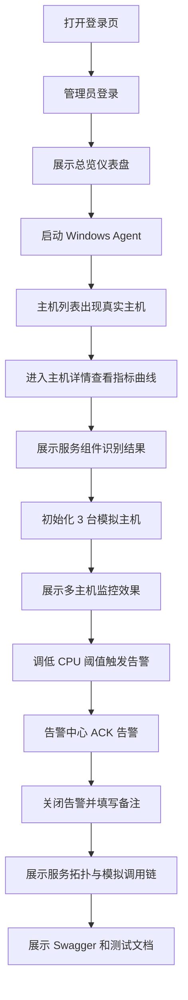

# AegisMonitor 页面原型与演示流

## 1. 设计目标

页面原型用于确定 AegisMonitor 前端监控台的信息架构、页面路由、核心布局和答辩演示路径。MVP 前端采用企业后台管理台风格，总览页具备轻量监控大屏感，但整体保持清晰、稳重、可操作。

设计原则：

- 首页直接进入可用监控台，不做营销式落地页。
- 数据密度适中，便于运维人员快速扫描。
- 图表用于表达趋势，表格用于承载列表和处理动作。
- 页面刷新采用定时轮询和手动刷新。
- 真实 Agent 和模拟主机数据在界面中可区分。

## 2. 前端技术栈

- Vue 3
- Vite
- Element Plus
- ECharts
- Vue Router
- Axios 或等价请求库

## 3. 路由规划

| 路由 | 页面 | 权限 |
| --- | --- | --- |
| /login | 登录页 | 公开 |
| /dashboard | 总览仪表盘 | SYSTEM_ADMIN / OPS_ENGINEER |
| /hosts | 主机列表 | SYSTEM_ADMIN / OPS_ENGINEER |
| /hosts/:hostId | 主机详情 | SYSTEM_ADMIN / OPS_ENGINEER |
| /services | 服务组件 | SYSTEM_ADMIN / OPS_ENGINEER |
| /topology | 服务拓扑 | SYSTEM_ADMIN / OPS_ENGINEER |
| /alerts/events | 告警中心 | SYSTEM_ADMIN / OPS_ENGINEER |
| /alerts/rules | 告警规则 | SYSTEM_ADMIN / OPS_ENGINEER |
| /agents | Agent 管理 | SYSTEM_ADMIN |
| /users | 用户管理 | SYSTEM_ADMIN |

## 4. 全局布局

```text
┌─────────────────────────────────────────────────────────────┐
│ 顶部栏：AegisMonitor / 当前用户 / 角色 / 手动刷新 / 退出     │
├───────────────┬─────────────────────────────────────────────┤
│ 侧边导航       │ 页面内容区                                   │
│               │                                             │
│ 总览仪表盘     │ 当前页面标题 + 筛选条件 + 主要内容             │
│ 主机监控       │                                             │
│ 服务组件       │                                             │
│ 服务拓扑       │                                             │
│ 告警中心       │                                             │
│ 告警规则       │                                             │
│ Agent 管理     │                                             │
│ 用户管理       │                                             │
└───────────────┴─────────────────────────────────────────────┘
```

导航规则：

- `SYSTEM_ADMIN` 显示全部菜单。
- `OPS_ENGINEER` 不显示用户管理，Agent 管理只读或不显示。
- `DEVELOPER_READONLY` 为设计扩展，MVP 不实现真实菜单。

## 5. 登录页原型

目标：

- 输入用户名和密码。
- 登录成功后进入总览仪表盘。
- 登录失败显示错误提示。

线框：

```text
┌────────────────────────────────────┐
│ AegisMonitor 一体化监控平台          │
│                                    │
│ 用户名  [ admin                 ]  │
│ 密码    [ ********              ]  │
│                                    │
│ [ 登录 ]                           │
│                                    │
│ 演示账号：admin / ops01             │
└────────────────────────────────────┘
```

接口：

- `POST /api/auth/login`
- `GET /api/auth/me`

验收：

- 正确账号可进入系统。
- 错误密码有明确提示。
- 登录后请求携带 JWT。

## 6. 总览仪表盘原型

目标：

- 快速展示系统整体健康状态。
- 作为答辩第一屏，体现监控平台观感。

内容：

- 主机总数。
- 在线 Agent 数。
- 活跃告警数。
- 最高 CPU 使用率。
- 平均内存使用率。
- 最近 10 分钟 CPU/内存趋势。
- 告警级别分布。
- 最近告警列表。

线框：

```text
┌─────────────────────────────────────────────────────────────┐
│ 总览仪表盘                                      [手动刷新]   │
├────────────┬────────────┬────────────┬────────────┬────────┤
│ 主机总数 5 │ 在线 4     │ 活跃告警 3 │ 最高CPU 91%│ 内存 62%│
├──────────────────────────────┬──────────────────────────────┤
│ CPU / 内存趋势折线图           │ 告警级别分布                 │
│                              │ INFO / WARNING / CRITICAL    │
├──────────────────────────────┴──────────────────────────────┤
│ 最近告警：时间 / 级别 / 对象 / 内容 / 状态                    │
└─────────────────────────────────────────────────────────────┘
```

接口：

- `GET /api/hosts`
- `GET /api/alerts/events`
- `GET /api/hosts/{hostId}/metrics`

刷新：

- 5 秒自动刷新。
- 支持手动刷新。

## 7. 主机列表页原型

目标：

- 展示所有真实和模拟主机。
- 支持按状态、分组、标签筛选。

线框：

```text
┌─────────────────────────────────────────────────────────────┐
│ 主机列表                                      [手动刷新]     │
├─────────────────────────────────────────────────────────────┤
│ 状态 [全部 v]  分组 [全部 v]  标签 [全部 v]  搜索 [      ]   │
├─────────────────────────────────────────────────────────────┤
│ 主机名        IP            分组      标签        状态 告警 │
│ DESKTOP-A     192.168.1.10  演示环境  真实,Java   在线 1    │
│ demo-web-01   10.0.0.11     演示环境  模拟,Nginx  在线 1    │
│ demo-db-01    10.0.0.12     演示环境  模拟,MySQL  在线 1    │
└─────────────────────────────────────────────────────────────┘
```

关键交互：

- 点击主机名进入主机详情。
- 状态用颜色区分：在线、离线、未知。
- 模拟主机带“模拟数据”标签。

接口：

- `GET /api/hosts`

## 8. 主机详情页原型

目标：

- 展示单台主机的基础信息、资源指标和 TCP 信息。
- 这是 Agent 真实采集能力的重点展示页面。

线框：

```text
┌─────────────────────────────────────────────────────────────┐
│ 主机详情：DESKTOP-A                            [手动刷新]   │
├─────────────────────────────────────────────────────────────┤
│ 基础信息：OS / IP / CPU核心 / 内存总量 / 启动时间 / 最近心跳 │
├──────────────────────────────┬──────────────────────────────┤
│ CPU 使用率折线图              │ 内存使用率折线图              │
├──────────────────────────────┴──────────────────────────────┤
│ 磁盘分区：C: 60% / D: 42%                                   │
├──────────────────────────────┬──────────────────────────────┤
│ 网络收发速率折线图            │ TCP 连接数 / 监听端口列表      │
└──────────────────────────────┴──────────────────────────────┘
```

接口：

- `GET /api/hosts/{hostId}`
- `GET /api/hosts/{hostId}/metrics?range=10m`

空状态：

- 无指标数据时显示“暂无指标数据，等待 Agent 上报”。

## 9. 服务组件页原型

目标：

- 展示 Agent 自动识别出的服务和技术栈。
- 回应课题要求中的“识别服务和组件”。

线框：

```text
┌─────────────────────────────────────────────────────────────┐
│ 服务组件                                                    │
├─────────────────────────────────────────────────────────────┤
│ 主机 [全部 v]  技术栈 [全部 v]  状态 [全部 v]                │
├─────────────────────────────────────────────────────────────┤
│ 服务名          技术栈       主机        PID    端口   状态  │
│ aegis-backend   SpringBoot   DESKTOP-A   10240  8080   运行  │
│ mysql           MySQL        demo-db-01  3306   3306   运行  │
│ redis           Redis        demo-db-01  6379   6379   运行  │
└─────────────────────────────────────────────────────────────┘
```

接口：

- `GET /api/services`
- `POST /api/services/report`
- `POST /api/metrics/services`

## 10. 服务拓扑页原型

目标：

- 展示轻量服务拓扑和模拟调用链。
- 作为答辩亮点，说明系统对调用关系的扩展设计。

线框：

```text
┌─────────────────────────────────────────────────────────────┐
│ 服务拓扑                                                    │
├─────────────────────────────────────────────────────────────┤
│                                                             │
│      [Nginx] ──HTTP──> [Spring Boot API] ──JDBC──> [MySQL]  │
│                                  │                          │
│                                  └──Cache──> [Redis]        │
│                                                             │
├─────────────────────────────────────────────────────────────┤
│ 调用链详情：耗时 / 状态 / 时间 / Span 列表                  │
└─────────────────────────────────────────────────────────────┘
```

交互：

- 点击节点：显示服务详情。
- 点击边：显示模拟调用链详情。

接口：

- `GET /api/topology/services`
- `GET /api/topology/traces/{edgeId}`

## 11. 告警中心页原型

目标：

- 展示告警事件。
- 支持 ACK 和关闭，体现运维闭环。

线框：

```text
┌─────────────────────────────────────────────────────────────┐
│ 告警中心                                      [手动刷新]     │
├─────────────────────────────────────────────────────────────┤
│ 状态 [NEW v]  级别 [全部 v]  对象 [      ]                  │
├─────────────────────────────────────────────────────────────┤
│ 时间        级别      对象         内容              状态 操作│
│ 17:30:00    WARNING   DESKTOP-A    CPU 使用率过高    NEW  ACK │
│ 17:31:00    CRITICAL  demo-db-01   磁盘使用率过高    ACK 关闭 │
└─────────────────────────────────────────────────────────────┘
```

ACK 弹窗：

```text
┌──────────────────────────────┐
│ 确认告警                      │
│ 处理备注 [                  ] │
│ [取消] [确认]                 │
└──────────────────────────────┘
```

接口：

- `GET /api/alerts/events`
- `POST /api/alerts/events/{eventId}/ack`
- `POST /api/alerts/events/{eventId}/close`

刷新：

- 10 秒自动刷新。

## 12. 告警规则页原型

目标：

- 允许运维工程师修改阈值。
- 用于答辩演示“调低阈值触发告警”。

线框：

```text
┌─────────────────────────────────────────────────────────────┐
│ 告警规则                                                    │
├─────────────────────────────────────────────────────────────┤
│ 规则名              指标类型       阈值      级别     启用  │
│ CPU 使用率过高      CPU_USAGE      80       WARNING  是    │
│ 内存使用率过高      MEMORY_USAGE   85       WARNING  是    │
│ 磁盘使用率过高      DISK_USAGE     90       CRITICAL 是    │
└─────────────────────────────────────────────────────────────┘
```

接口：

- `GET /api/alerts/rules`
- `PUT /api/alerts/rules/{ruleId}`

## 13. Agent 管理页原型

目标：

- 展示 Agent 接入状态。
- 体现企业级 Agent 纳管思维。

权限：

- SYSTEM_ADMIN。

线框：

```text
┌─────────────────────────────────────────────────────────────┐
│ Agent 管理                                                  │
├─────────────────────────────────────────────────────────────┤
│ [生成演示注册 Token]                                        │
├─────────────────────────────────────────────────────────────┤
│ Agent ID  主机        版本   状态    最近心跳       审批状态│
│ agt_001   DESKTOP-A   0.1.0  在线    17:30:00       已通过  │
└─────────────────────────────────────────────────────────────┘
```

接口：

- `GET /api/agents`
- `POST /api/agents/register`

MVP 简化：

- 注册审批默认通过。
- 页面展示 Token 摘要和 Agent 状态。

## 14. 用户管理页原型

目标：

- 超级管理员创建和查看用户。
- 展示 RBAC 思维。

权限：

- SYSTEM_ADMIN。

线框：

```text
┌─────────────────────────────────────────────────────────────┐
│ 用户管理                                      [新增用户]     │
├─────────────────────────────────────────────────────────────┤
│ 用户名      显示名          角色             状态           │
│ admin       系统管理员      SYSTEM_ADMIN     启用           │
│ ops01       运维工程师01    OPS_ENGINEER     启用           │
└─────────────────────────────────────────────────────────────┘
```

接口：

- `GET /api/users`
- `POST /api/users`

## 15. 答辩演示流

建议演示路径：



## 16. 页面实现优先级

| 页面 | 优先级 | 原因 |
| --- | --- | --- |
| 登录页 | P1 | 支撑权限展示 |
| 总览仪表盘 | P1 | 答辩第一屏 |
| 主机列表 | P0 | 主链路展示入口 |
| 主机详情 | P0 | 指标采集核心展示 |
| 服务组件 | P1 | 回应服务识别要求 |
| 告警中心 | P1 | 展示告警处理闭环 |
| 告警规则 | P1 | 支撑现场触发告警 |
| Agent 管理 | P2 | 企业级接入管理亮点 |
| 用户管理 | P2 | 权限模型展示 |
| 服务拓扑 | P2 | 调用链扩展亮点 |

## 17. 前端状态设计

每个数据页面至少考虑：

- 加载中。
- 空数据。
- 请求失败。
- 手动刷新。
- 自动刷新。
- 权限不足。

主机状态：

- ONLINE：在线。
- OFFLINE：离线。
- UNKNOWN：未知。

告警状态：

- NEW：新告警。
- ACKED：已确认。
- CLOSED：已关闭。

告警级别：

- INFO。
- WARNING。
- CRITICAL。

## 18. 后续实现提醒

- ECharts 容器需要固定高度，避免图表不显示。
- 页面表格应优先保证可读性，不追求装饰。
- 自动刷新需要在页面卸载时清理定时器。
- API 错误提示统一处理。
- 模拟数据标签要明显，避免答辩时被误解为真实主机。

