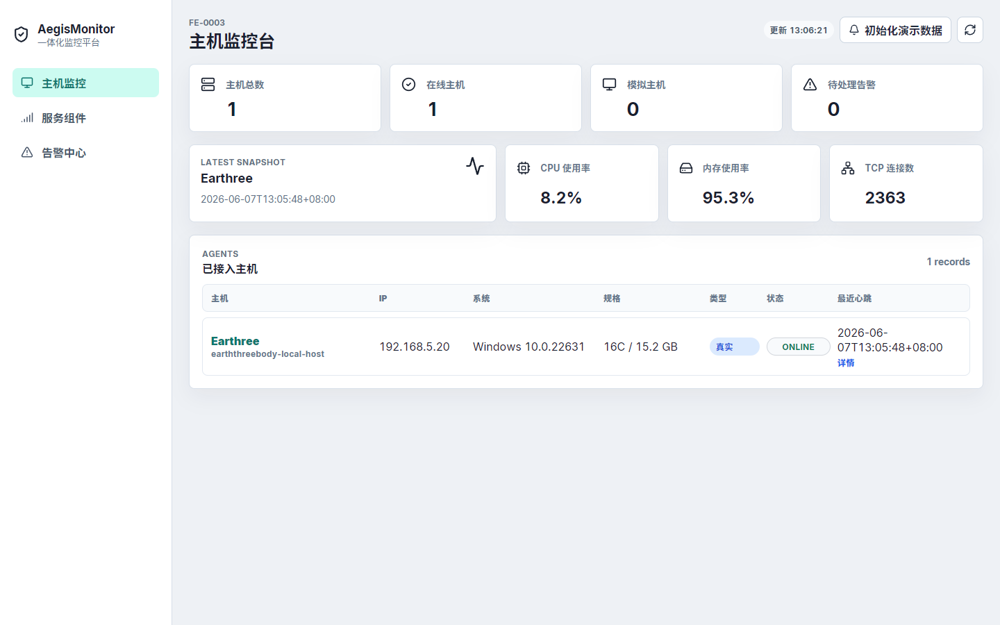
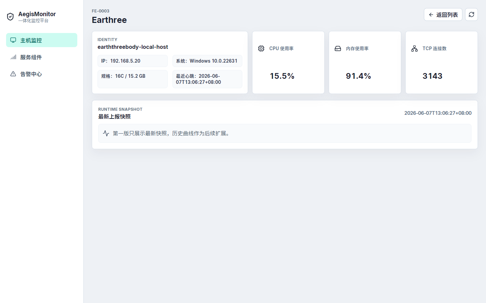

# AegisMonitor 多主机接入与演示部署说明

## 1. 演示目标

TEAM-01 的目标是证明 AegisMonitor 不是纯模拟系统：中心电脑运行 MySQL、Spring Boot 后端和 Vue 前端，其他 Windows 电脑只运行 Python Agent，也能作为真实被监控主机出现在 `/hosts` 主机列表和主机详情页中。

本说明优先保证课程设计现场演示可用，不扩展到云服务器、Docker 全量部署或复杂运维方案。

## 2. 推荐拓扑

```text
中心电脑：
- Docker MySQL: 3306
- Spring Boot Backend: 8080
- Vue Frontend: 5173

被监控电脑：
- Python 3
- Python Agent
- 上报地址：http://中心电脑IP:8080/api
```

中心电脑和被监控电脑必须连接到同一个局域网。中心电脑 IP 以 `ipconfig` 中 Wi-Fi 或以太网网卡的 IPv4 为准，不要使用 Docker、VMware、WSL 等虚拟网卡地址。

本机预演时识别到的中心电脑局域网 IP 为 `192.168.5.20`，答辩现场请重新执行 `ipconfig` 确认。

## 3. 中心电脑启动步骤

### 3.1 同步分支

```powershell
git checkout master
git pull --ff-only origin master
git checkout -b feature/team-01-multi-host-demo
```

不要直接在 `master` 上提交或推送。

### 3.2 启动 MySQL

如果本机没有可用 MySQL，推荐直接使用 Docker：

```powershell
docker network create aegis-monitor-net

docker run -d `
  --name aegis-monitor-mysql `
  --network aegis-monitor-net `
  -p 3306:3306 `
  -e MYSQL_ROOT_PASSWORD=change-me `
  -e MYSQL_DATABASE=aegis_monitor `
  mysql:8.0
```

如果容器已经创建过，只需要启动：

```powershell
docker start aegis-monitor-mysql
```

等待 MySQL 就绪：

```powershell
docker exec aegis-monitor-mysql mysqladmin ping -uroot -pchange-me --silent
```

### 3.3 创建后端本地配置

复制示例配置：

```powershell
copy backend\application-local.example.yml backend\application-local.yml
```

如果后端也运行在 Docker Maven 容器中，`backend\application-local.yml` 使用：

```yaml
spring:
  datasource:
    url: jdbc:mysql://aegis-monitor-mysql:3306/aegis_monitor?useUnicode=true&characterEncoding=utf8&serverTimezone=Asia/Shanghai&useSSL=false&allowPublicKeyRetrieval=true
    username: root
    password: change-me
  sql:
    init:
      mode: always

aegis:
  agent:
    register-token: demo-register-token
```

如果后端直接运行在 Windows 本机 Maven 中，数据库地址改为 `localhost:3306`。

### 3.4 启动后端

本机没有安装 Maven 时，可直接用 Maven Docker 镜像运行：

```powershell
docker volume create aegis-monitor-maven-repo

docker run -d `
  --name aegis-monitor-backend `
  --network aegis-monitor-net `
  -p 8080:8080 `
  -v "${PWD}\backend:/workspace" `
  -v aegis-monitor-maven-repo:/root/.m2 `
  -w /workspace `
  maven:3.9.9-eclipse-temurin-17 `
  mvn spring-boot:run
```

确认后端可访问：

```powershell
Invoke-RestMethod http://localhost:8080/api/agents
```

如果返回 `success: true`，说明后端已启动。

### 3.5 启动前端

```powershell
cd frontend
npm ci
npm.cmd run dev -- --host 0.0.0.0
```

本机查看：

```text
http://127.0.0.1:5173/hosts
```

同学电脑如需查看前端：

```text
http://中心电脑IP:5173/hosts
```

## 4. 中心电脑防火墙

至少需要允许其他电脑访问后端 `8080`。如果同学电脑也要打开前端页面，还需要允许 `5173`。

以管理员身份打开 PowerShell：

```powershell
New-NetFirewallRule `
  -DisplayName "AegisMonitor Backend 8080" `
  -Direction Inbound `
  -Protocol TCP `
  -LocalPort 8080 `
  -Action Allow

New-NetFirewallRule `
  -DisplayName "AegisMonitor Frontend 5173" `
  -Direction Inbound `
  -Protocol TCP `
  -LocalPort 5173 `
  -Action Allow
```

如果 Windows 弹出网络访问提示，选择允许专用网络访问。

## 5. 本机 Agent 预演

本机预演用于先确认中心链路通畅。它不能替代最终的第二台真实电脑接入截图。

复制 Agent 配置：

```powershell
copy agent\agent.example.yml agent\agent.yml
```

本机预演配置：

```yaml
server_url: http://localhost:8080/api
register_token: demo-register-token
host_alias: earththreebody-local-host
host_metric_interval_seconds: 5
heartbeat_interval_seconds: 10
service_discovery_interval_seconds: 30
state_file: .agent-state.json
```

如果之前跑过 Agent，先删除状态文件：

```powershell
Remove-Item agent\.agent-state.json -ErrorAction SilentlyContinue
```

启动持续上报：

```powershell
agent\run.cmd --config agent\agent.yml
```

验证：

```powershell
Invoke-RestMethod http://localhost:8080/api/agents
Invoke-RestMethod "http://localhost:8080/api/metrics/host/latest?hostId=host_001"
Invoke-RestMethod "http://localhost:8080/api/services?hostId=host_001"
```

服务发现返回空列表是允许的，表示当前机器没有命中预置服务规则；主机、心跳和资源指标仍然可以证明真实 Agent 已接入。

## 6. 第二台 Windows 电脑接入步骤

### 6.1 在第二台电脑确认后端可访问

将 `中心电脑IP` 替换为中心电脑的局域网 IPv4：

```powershell
Invoke-RestMethod http://中心电脑IP:8080/api/agents
```

如果失败，优先检查：

- 两台电脑是否在同一个局域网。
- 中心电脑 IP 是否选错了虚拟网卡地址。
- 中心电脑防火墙是否放行 `8080`。
- 后端容器或 Spring Boot 是否仍在运行。

### 6.2 准备 Agent

第二台电脑需要 Python 3 和 `psutil`：

```powershell
python --version
python -m pip install -r agent\requirements.txt
```

如果没有完整仓库，可以只复制 `agent/` 目录到第二台电脑。

复制配置：

```powershell
copy agent\agent.example.yml agent\agent.yml
```

修改 `agent\agent.yml`：

```yaml
server_url: http://中心电脑IP:8080/api
register_token: demo-register-token
host_alias: team-01-remote-windows
host_metric_interval_seconds: 5
heartbeat_interval_seconds: 10
service_discovery_interval_seconds: 30
state_file: .agent-state.json
```

### 6.3 删除旧状态并启动

如果这台电脑之前跑过 Agent，必须删除状态文件，避免复用别人的 `hostId`：

```powershell
Remove-Item agent\.agent-state.json -ErrorAction SilentlyContinue
agent\run.cmd --config agent\agent.yml
```

启动成功后，中心电脑前端 `/hosts` 应该能看到 `team-01-remote-windows`，状态为 `ONLINE`。

## 7. 截图与验收记录

当前提交中的两张图是本机预演截图，用于证明链路已经在 earththreebody 电脑上跑通。第二台 Windows 电脑接入后，请保持文件名不变，直接替换为真实远端主机截图。

主机列表截图：



主机详情截图：



最终验收时至少确认：

- `/hosts` 主机列表出现 `team-01-remote-windows`。
- 主机详情页 CPU、内存、TCP 连接数、最近心跳持续变化。
- 截图中的主机 IP 是第二台电脑的局域网 IP，而不是中心电脑 IP。

## 8. 常见问题

### 8.1 防火墙未放行

现象：第二台电脑访问 `http://中心电脑IP:8080/api/agents` 超时。

处理：中心电脑放行 `8080`；如需远端看前端，也放行 `5173`。

### 8.2 IP 地址选错

现象：本机能访问，第二台电脑访问失败。

处理：`ipconfig` 里优先选择 Wi-Fi 或以太网 IPv4，例如 `192.168.x.x` 或 `10.x.x.x`，不要选择 Docker、VMware、WSL、vEthernet。

### 8.3 端口被占用

现象：后端或前端启动失败，提示端口占用。

处理：

```powershell
netstat -ano | findstr :8080
netstat -ano | findstr :5173
```

关闭占用进程后重启；如果临时改端口，Agent 的 `server_url` 和前端访问地址也要同步调整。

### 8.4 `.agent-state.json` 复用

现象：两台电脑显示成同一个主机，或 hostId 没有变化。

原因：复制 Agent 目录时带走了 `agent\.agent-state.json`。

处理：每台新电脑首次接入前删除自己的 `agent\.agent-state.json`。

### 8.5 缺少 Python 或 psutil

现象：Agent 启动时报 `python` 找不到或 `No module named psutil`。

处理：

```powershell
python --version
python -m pip install -r agent\requirements.txt
```

### 8.6 代理设置

Clash `7897` 只在下载依赖慢或失败时使用。局域网访问中心电脑时不要把 `server_url` 写成代理地址。

临时设置下载代理：

```powershell
$env:HTTP_PROXY="http://127.0.0.1:7897"
$env:HTTPS_PROXY="http://127.0.0.1:7897"
```

## 9. 提交注意事项

不要提交：

- `backend/application-local.yml`
- `agent/agent.yml`
- `agent/.agent-state.json`
- `.playwright-cli/`
- `frontend/node_modules/`
- `frontend/dist/`
- `backend/target/`
- 日志文件和本地缓存

提交前检查：

```powershell
git status --short
```

本任务应只提交 `docs/AegisMonitor/15-多主机接入与演示部署说明.md` 和截图资产。
