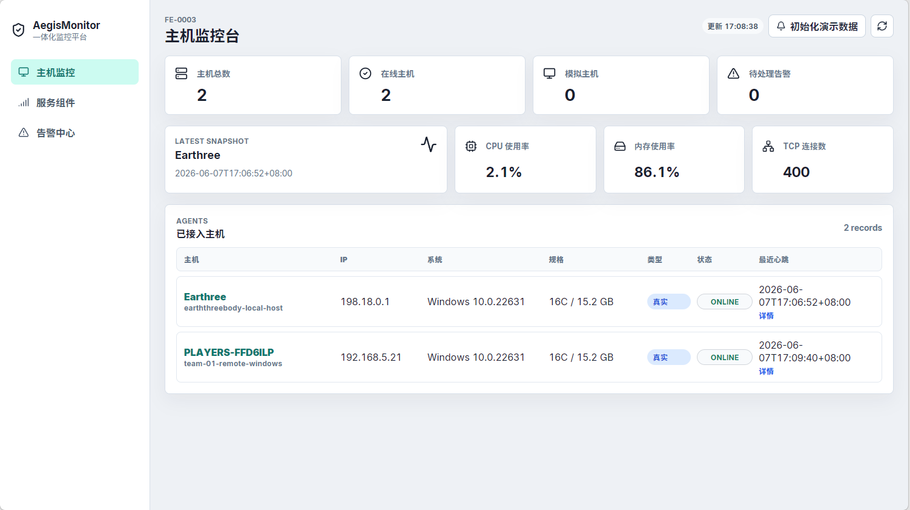
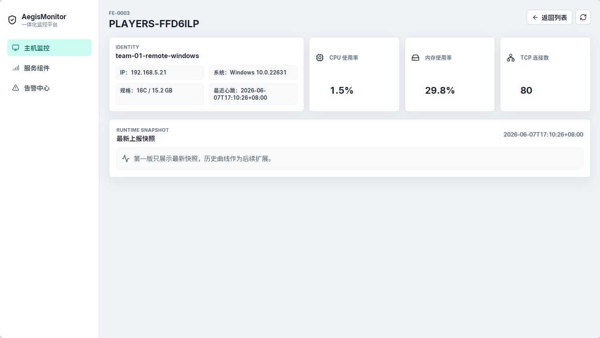
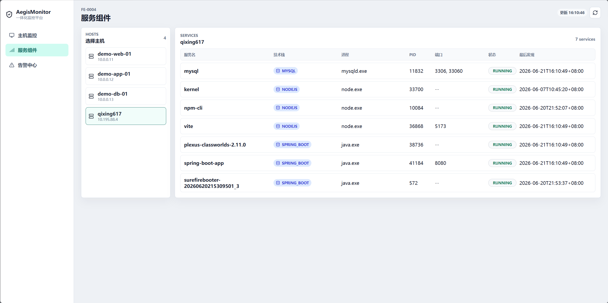
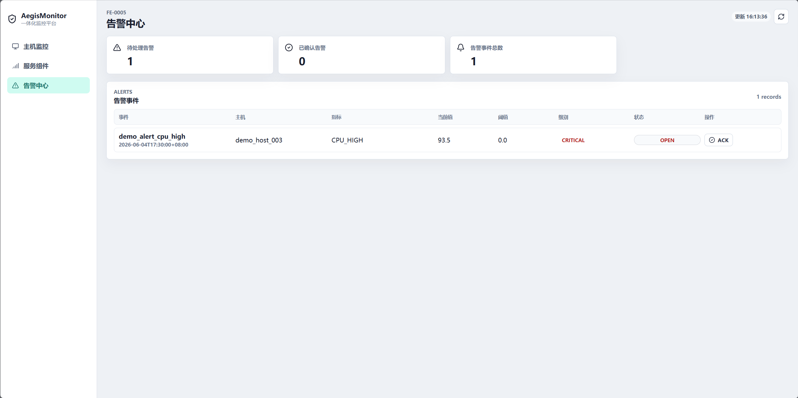
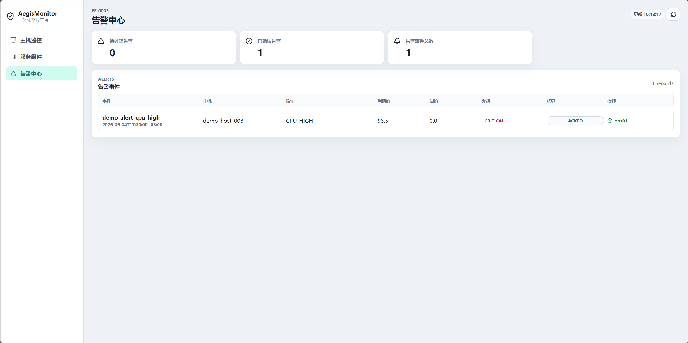

# AegisMonitor 测试记录与验收截图

## 1. 测试基线

| 项目 | 值 |
| --- | --- |
| 测试日期 | 2026-06-20 |
| 分支 | codex/final-product-metrics |
| 基线 | 已同步 GitHub master 中 PR #5、#6、#7 |
| Java | JDK 17 |
| 数据库 | MySQL 8.4（运行）；H2（自动化测试隔离） |
| 前端 | Vue 3 + Vite + ECharts |
| Agent | Python + psutil |

## 2. 自动化测试结果

| 模块 | 命令 | 结果 | 覆盖重点 |
| --- | --- | --- | --- |
| 后端 | backend\test.cmd | 21 项通过，0 失败 | Agent、指标历史、Demo seed、服务、告警 ACK、JDBC |
| 前端 | cd frontend; npm.cmd test | 20 项通过，0 失败 | API adapter、store、历史范围、服务、ACK、静默刷新 |
| 前端构建 | cd frontend; npm.cmd run build | 通过 | 2173 modules；主入口 127.86 kB；图表异步包 496.51 kB |
| Agent | agent\test.cmd | 18 项通过，0 失败 | 配置、注册、心跳、采集、持续运行、服务上报 |

自动化测试合计：**59 项通过，0 失败**。

## 3. MySQL 端到端验证

2026-06-20 使用本地 MySQL、Spring Boot、Vue 和持续运行 Agent 验证：

| 验证项 | 实际结果 | 状态 |
| --- | --- | --- |
| 后端健康 | GET /api/agents 返回成功 | 通过 |
| 前端访问 | http://127.0.0.1:5173/hosts 返回 HTTP 200 | 通过 |
| 真实 Agent | qixing617 / host_001 持续上报 | 通过 |
| 历史指标 | 10 分钟范围返回 29 个点，时间由 21:49:35 推进到 21:54:08 | 通过 |
| Demo 历史 | 每台 Demo 主机生成 11 个确定性升序点 | 通过 |
| 服务发现 | demo-web-01 返回 NGINX，端口 80，RUNNING | 通过 |
| 告警 ACK | demo_alert_cpu_high 从 OPEN 变为 ACKED，保存确认人和备注 | 通过 |
| 演示复位 | 再次 Demo seed 后告警恢复为 OPEN | 通过 |

关键接口：

~~~powershell
Invoke-RestMethod http://127.0.0.1:8080/api/agents
Invoke-RestMethod "http://127.0.0.1:8080/api/metrics/host/latest?hostId=host_001"
Invoke-RestMethod "http://127.0.0.1:8080/api/metrics/host/history?hostId=host_001&range=10m"
Invoke-RestMethod "http://127.0.0.1:8080/api/services?hostId=demo_host_001"
Invoke-RestMethod http://127.0.0.1:8080/api/alerts
~~~

## 4. 已有真实多主机截图

### 4.1 主机列表

截图显示中心电脑 Earththree 与远程 Windows 主机 PLAYERS-FFD6ILP 同时在线，远程主机 IP 为 192.168.5.21。

### 4.2 真实主机详情

截图显示远程主机别名 team-01-remote-windows、CPU、内存、TCP 和最近心跳。

### 4.3 服务组件

截图显示 demo-web-01 的 NGINX 服务、进程、PID、端口 80 和 RUNNING 状态。

### 4.4 告警 ACK 前

截图显示高 CPU 告警处于 OPEN 状态，ACK 操作可用。

### 4.5 告警 ACK 后

截图显示同一告警已变为 ACKED，并保留确认结果。

## 5. 最终页面截图清单

| 编号 | 文件名 | 页面与要求 | 当前状态 |
| --- | --- | --- | --- |
| 1 | team-01-host-list.png | 至少两台真实主机同时在线 | 已完成 |
| 2 | team-01-host-detail.png | 远程主机基础信息和实时指标 | 已完成 |
| 3 | final-service-components.png | demo-web-01 的 NGINX、端口 80、RUNNING | 已完成 |
| 4 | final-alert-open.png | 高 CPU 告警为 OPEN，ACK 按钮可见 | 已完成 |
| 5 | final-alert-acked.png | 同一告警变为 ACKED，确认人可见 | 已完成 |

截图保存到 docs/AegisMonitor/assets/，建议 1440×900 或 1920×1080。不得截入数据库密码、Agent Secret、个人聊天或无关窗口。

### 5.1 服务组件截图

1. 调用 Demo seed。
2. 打开 http://127.0.0.1:5173/services。
3. 选择 demo-web-01，确认 NGINX、nginx.exe、PID、端口 80、RUNNING 可见。
4. 保存为 assets/final-service-components.png。

### 5.2 告警 ACK 前后截图

1. 调用 Demo seed，打开 http://127.0.0.1:5173/alerts。
2. 截取 demo_alert_cpu_high 为 OPEN 且 ACK 按钮可见，保存 final-alert-open.png。
3. 点击 ACK，填写确认人和非空处理备注后提交。
4. 截取 ACKED 状态和已确认计数，保存 final-alert-acked.png。
5. 再调用 Demo seed，把告警恢复为 OPEN。

## 6. 功能验收矩阵

| 能力 | 状态 | 证据 |
| --- | --- | --- |
| Agent 注册、凭证和心跳 | 已实现 | Agent 测试、真实主机列表 |
| CPU、内存、TCP 采集 | 已实现 | 真实详情、最新指标接口 |
| 历史指标与曲线 | 已实现 | MySQL 历史接口、ECharts 三指标三范围 |
| 服务发现 | 已实现 | 服务接口、NGINX Demo |
| 告警与 ACK | 已实现 | 自动化测试、端到端 ACK |
| 多真实主机接入 | 已实现 | TEAM-01 实机截图、15 号部署文档 |
| 登录、完整 RBAC | 后续扩展 | 需求与设计文档保留角色模型 |
| 规则编辑、通知渠道 | 后续扩展 | 当前固定 CPU 阈值和站内 ACK |
| 服务拓扑、调用链 | 后续扩展 | 当前交付服务清单 |
| InfluxDB、大规模部署 | 后续扩展 | 当前课程规模使用 MySQL Repository |

## 7. 验收结论

核心监控闭环、59 项自动化测试和五张验收截图均已完成，五人分工和现场演示步骤已经明确，Issue #4 的交付材料满足验收条件。
