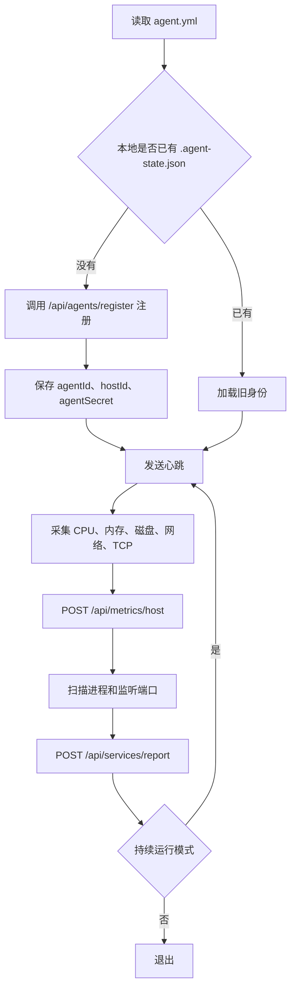
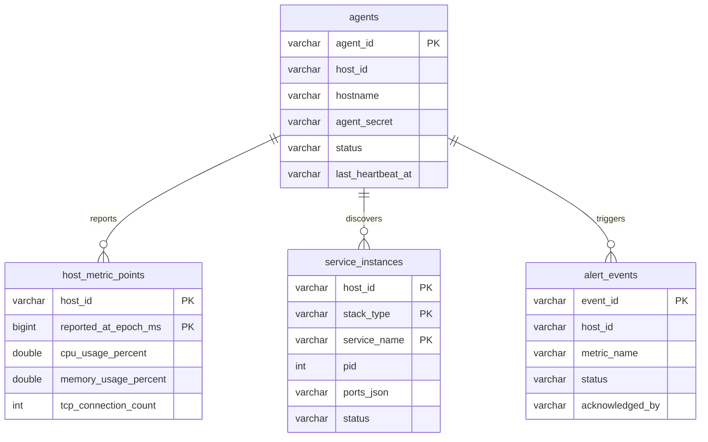
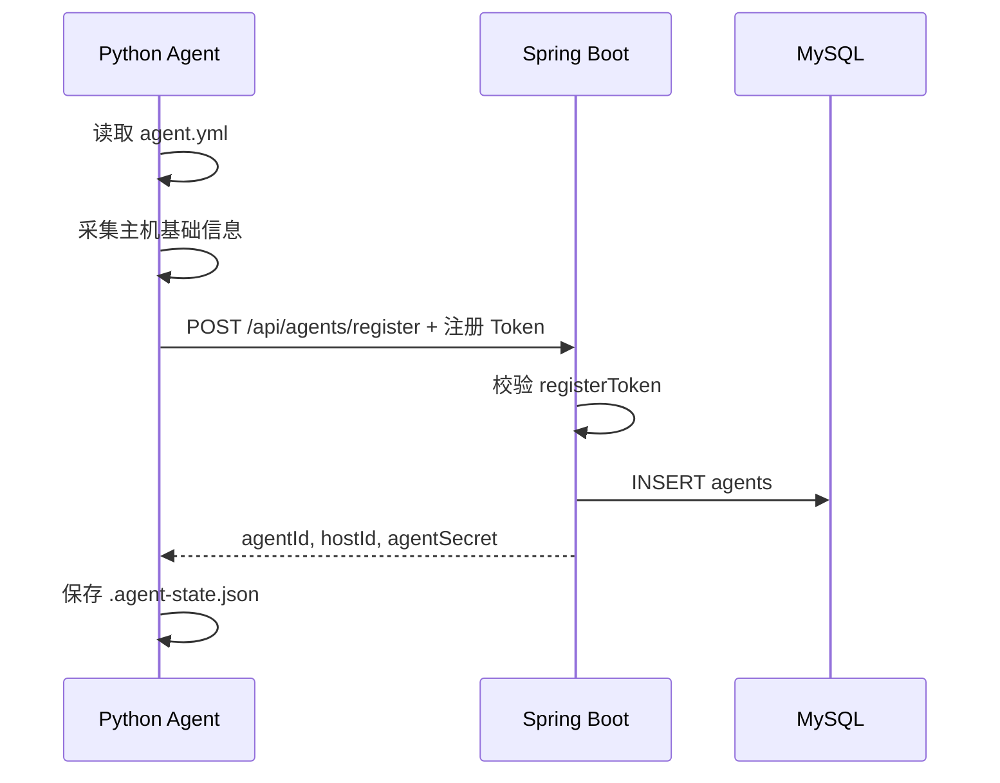
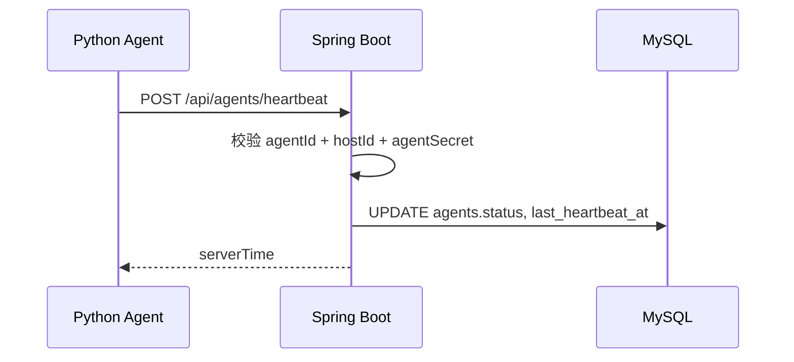
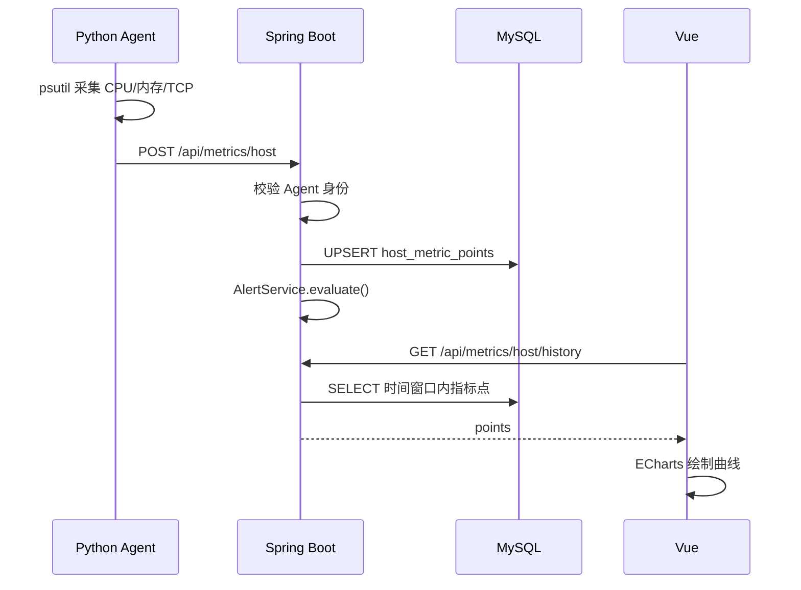
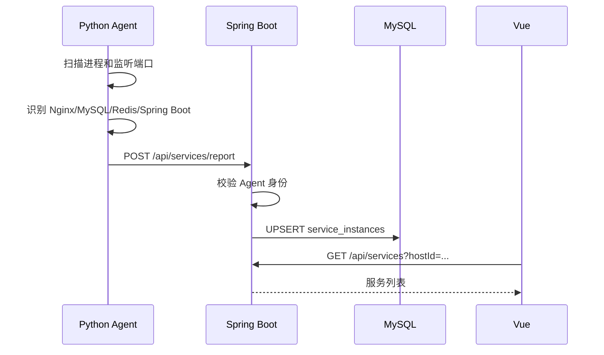
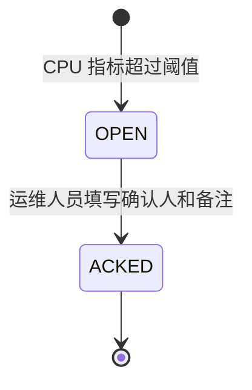

# AegisMonitor 项目讲解手册（答辩版）

> 适用对象：需要在答辩前快速、完整理解本项目的人。  
> 阅读目标：你不只是能“打开页面演示”，而是能讲清楚系统为什么这样设计、数据怎么流动、每个模块负责什么、关键代码在哪里、评委追问时怎么回答。

## 0. 先给你一条主线

AegisMonitor 是一个课程设计级的一体化监控平台。它的核心不是页面好不好看，而是完整打通了下面这条监控闭环：

```text
真实 Windows 主机
-> Python Agent 采集主机和服务数据
-> HTTP JSON 上报到 Spring Boot 后端
-> 后端校验 Agent 身份、保存 MySQL、判断告警
-> Vue 前端展示主机、指标曲线、服务组件、告警
-> 运维人员 ACK 告警，形成处理闭环
```

答辩时你可以用一句话概括：

> 我们实现了一个课程设计规模的监控平台 MVP。它支持真实 Agent 接入、主机指标采集、历史趋势展示、服务发现、告警生成和告警 ACK 闭环，并用自动化测试和实机截图证明系统不是静态页面。

## 1. 后天答辩速读路线

如果时间很紧，建议按这个顺序读：

1. 本手册第 2、3、4 节：先懂“监控平台到底在解决什么问题”。
2. 第 5 节：记住仓库结构和三大模块。
3. 第 6、7、8、9 节：分别理解 Agent、后端、数据库、前端。
4. 第 10 节：背熟 5 条核心数据流。
5. 第 11 节：按演示路线练一遍。
6. 第 13 节：准备评委常问问题。
7. 第 14 节：记住当前边界，哪些已实现，哪些是扩展。

不要一开始钻进所有代码。先把系统当成一个“信息流动机器”，再看每个函数在这台机器里负责哪一步。

## 2. 从第一性原理理解监控平台

### 2.1 为什么需要监控

一个软件系统运行起来以后，最重要的问题不是“代码写完了吗”，而是：

- 主机还活着吗？
- CPU、内存是不是快满了？
- 服务进程有没有启动？
- 数据库、Web 服务、缓存这些组件有没有异常？
- 出了问题以后，谁看到了，谁处理了，处理记录在哪里？

这就是监控平台的基本任务：把看不见的运行状态变成可观察、可记录、可处理的数据。

### 2.2 监控平台的最小闭环

从最根本的角度看，监控平台至少需要 6 个动作：

| 步骤 | 含义 | 本项目对应模块 |
| --- | --- | --- |
| 1. 识别对象 | 知道要监控哪台机器 | Agent 注册，生成 `agentId` 和 `hostId` |
| 2. 采集信号 | 从机器上读取 CPU、内存、TCP、服务进程 | Python Agent + psutil |
| 3. 传输数据 | 把采集结果发给中心服务 | HTTP POST JSON |
| 4. 存储数据 | 保存主机、服务、指标、告警 | MySQL |
| 5. 展示状态 | 让人能在页面看懂 | Vue + ECharts |
| 6. 处理异常 | 告警被确认，形成闭环 | 告警 ACK |

如果没有第 6 步，系统只是“展示数据”；有了 ACK，才更像真实运维场景，因为它记录了“问题被人接手处理”。

### 2.3 为什么是 Agent 主动上报

监控有两种常见方式：

| 方式 | 解释 | 优缺点 |
| --- | --- | --- |
| 中心拉取 | 后端主动访问每台主机 | 后端要知道每台机器地址，网络和防火墙更复杂 |
| Agent 上报 | 每台机器自己把数据发给后端 | 更适合局域网演示，主机只需要能访问中心后端 |

本项目选择 Agent 主动上报。答辩时可以这样说：

> 我们采用 Agent 主动上报模型。这样中心平台不需要主动扫描每台主机，只要被监控主机能访问后端的 8080 端口，就能完成注册、心跳、指标和服务发现上报，比较适合课程设计中的多电脑局域网演示。

### 2.4 课程设计级和企业级的差别

本项目是课程设计级，不是假装企业级。区别如下：

| 方面 | 本项目已做到 | 企业级会继续做 |
| --- | --- | --- |
| 主机规模 | 约 5 台主机演示 | 上百上千节点、集群调度 |
| 指标存储 | MySQL 存课程规模历史指标 | InfluxDB、Prometheus、分区、降采样 |
| 刷新方式 | 前端轮询 | WebSocket、SSE、消息队列 |
| 权限 | 角色模型写入文档，MVP 未完整登录 RBAC | 完整用户、租户、权限隔离 |
| 告警 | CPU 阈值告警和 ACK | 多规则、去重、收敛、通知渠道 |
| 部署 | 本地或局域网演示 | Docker Compose、K8s、云部署、高可用 |

这不是缺点，而是边界清晰。答辩时不要说“我们已经做了完整企业级平台”，要说：

> 我们把企业级监控平台的核心思想压缩成课程设计可运行 MVP，优先保证真实主机接入、指标上报、历史趋势、服务组件和告警 ACK 主链路。

## 3. 用 C++ 思维理解本项目技术栈

你目前主要会 C++，所以可以用下面的类比理解：

| 你熟悉的 C++ 概念 | 本项目里的对应概念 |
| --- | --- |
| `struct` | Java `record`、Python `dataclass`，用于表示数据结构 |
| 类的成员函数 | Java class 方法、Python class 方法 |
| 头文件里的接口 | Java interface，比如 `AgentRepository` |
| 实现类 | `JdbcAgentRepository` 这种具体实现 |
| 主函数 `main()` | Spring Boot 的 `AegisMonitorApplication.main()`，Python 的 `cli.main()` |
| socket 网络通信 | 这里封装成 HTTP JSON 请求 |
| 文件读写 | Agent 读 `agent.yml`，写 `.agent-state.json` |
| 数组或 vector | JSON 数组、Java `List`、Python `list` |
| 状态机 | 告警从 `OPEN` 到 `ACKED` |

几个关键语言差异：

- Java 的 `record` 可以理解成“主要用来存数据的结构体”，例如 `AlertEvent`、`AgentRecord`。
- Spring Boot 的 `@RestController` 可以理解成“把 HTTP 路径映射到函数调用”。
- Vue 的 `.vue` 文件把页面逻辑和 HTML 模板放在一起。
- Python 的 `dataclass` 和 C++ `struct` 很像，主要是方便保存字段。

## 4. 当前项目做到什么程度

按目前文档和代码，项目已经完成：

- Python Agent 配置读取、注册、身份持久化、心跳、主机指标采集、服务发现。
- Spring Boot 后端 Agent 注册、心跳、指标上报、服务上报、告警查询、ACK、Demo seed。
- MySQL 持久化 Agent、历史指标、服务组件、告警事件。
- Vue 前端主机列表、主机详情、历史曲线、服务组件、告警中心。
- 多真实主机局域网接入文档和截图。
- 64 项自动化测试记录：后端 26 项、前端 20 项、Agent 18 项。
- 答辩 PPT、演示脚本、测试记录和验收截图。

仍然属于后续扩展：

- 完整登录和真实 RBAC。
- 告警规则编辑页面。
- 企业微信、邮件、短信通知。
- 服务拓扑图和真实调用链追踪。
- InfluxDB 生产级时序存储。
- 云服务器或 Docker Compose 全量部署。

## 5. 仓库结构

根目录主要是：

```text
agent/       Python Agent，运行在被监控主机上
backend/     Spring Boot 后端，负责 API、认证、存储、告警
frontend/    Vue 前端，负责监控台展示和交互
docs/        软件工程文档、演示步骤、测试记录、截图
projects/    PPT 生成过程文件
README.md    项目启动、协作和多主机接入说明
```

你答辩时可以这样讲：

> 我们不是把所有代码写在一起，而是按 Agent、Backend、Frontend 分层。Agent 解决采集，后端解决接收和业务规则，前端解决可视化展示。这样模块边界清晰，团队协作时也方便分工。

## 6. Agent 模块详解

Agent 是运行在被监控电脑上的采集程序。本项目 Agent 用 Python 写，因为 Python 的 `psutil` 很适合快速读取系统指标。

### 6.1 Agent 的工作流程



### 6.2 配置读取

关键文件：`agent/aegis_agent/config.py`

关键结构：

```python
@dataclass(frozen=True)
class AgentConfig:
    server_url: str
    register_token: str
    host_alias: str
    host_metric_interval_seconds: int
    heartbeat_interval_seconds: int
    service_discovery_interval_seconds: int
    state_file: Path
```

含义：

- `server_url`：后端 API 地址，例如 `http://localhost:8080/api`。
- `register_token`：首次注册用的令牌。
- `host_alias`：这台机器在平台里的别名。
- `host_metric_interval_seconds`：指标采集间隔。
- `state_file`：保存 Agent 身份的文件。

关键函数：

| 函数 | 作用 |
| --- | --- |
| `load_config(path)` | 读取配置文件，转成 `AgentConfig` |
| `_read_flat_yaml(path)` | 读取简单 YAML，每行解析成 key/value |

为什么不用复杂 YAML 库：

> 为了减少课程演示环境依赖，当前配置文件是扁平结构，用简单解析就够。真正生产环境可以换成 PyYAML，但 MVP 阶段不增加无谓依赖。

### 6.3 主机基础信息采集

关键文件：`agent/aegis_agent/host_collector.py`

关键函数：

| 函数 | 作用 |
| --- | --- |
| `collect_host_snapshot(agent_version)` | 汇总主机名、IP、系统版本、CPU 核数、内存、启动时间 |
| `_detect_ip_address()` | 通过 UDP socket 推断本机局域网 IP |
| `_memory_total_bytes()` | 根据系统类型读取内存总量 |
| `_windows_memory_total_bytes()` | Windows 下调用 `GlobalMemoryStatusEx` |
| `_boot_time_iso()` | 估算机器启动时间，并转成 ISO 时间字符串 |

这里最值得讲的是 `_detect_ip_address()`：

- 它不是访问 Google DNS 取数据，而是通过连接 `8.8.8.8:80` 让操作系统选择默认出口网卡。
- 然后读取 socket 的本地地址，这通常就是局域网 IP。
- 如果失败，就返回 `127.0.0.1` 兜底。

答辩话术：

> Agent 注册时不是手填主机信息，而是自动采集主机名、IP、系统、CPU 核数和内存总量，这样后端能形成主机资产记录。

### 6.4 Agent 身份持久化

关键文件：`agent/aegis_agent/identity.py`

关键结构：

```python
@dataclass(frozen=True)
class AgentIdentity:
    agent_id: str
    host_id: str
    agent_secret: str
```

关键类：`AgentStateStore`

| 方法 | 作用 |
| --- | --- |
| `save(identity)` | 把身份保存到 `.agent-state.json` |
| `load()` | 下次启动时恢复身份 |

为什么需要 `.agent-state.json`：

- 第一次启动时，Agent 还没有身份，需要注册。
- 注册成功后，后端返回 `agentId`、`hostId`、`agentSecret`。
- 下次启动如果不复用身份，就会在后端变成一台新主机。
- 所以必须本地保存身份。

多主机演示时最常见问题：

> 如果把整份 Agent 目录复制给同学，连 `.agent-state.json` 也复制过去，两台电脑会复用同一个 `hostId`，页面上就像同一台主机。正确做法是每台新电脑第一次接入前删除 `.agent-state.json`。

### 6.5 注册流程

关键文件：`agent/aegis_agent/registration.py`

关键类：`AgentRegistrar`

关键方法：`register(host)`

它做了 4 件事：

1. 把 `HostSnapshot` 转成后端需要的注册 JSON。
2. 调用 `POST /api/agents/register`。
3. 从响应里拿到 `agentId`、`hostId`、`agentSecret`。
4. 调用 `AgentStateStore.save()` 保存身份。

对应后端 Header：

```text
X-Agent-Register-Token: demo-register-token
```

答辩话术：

> 注册 Token 只用于首次纳管。注册成功后，Agent 后续不再用注册 Token，而是使用独立的 `agentId` 和 `agentSecret` 上报，避免所有主机共用一个长期凭证。

### 6.6 心跳上报

关键文件：`agent/aegis_agent/heartbeat.py`

关键类：`HeartbeatReporter`

关键方法：`report(identity, status, reported_at)`

它向后端发：

```json
{
  "agentId": "agt_001",
  "hostId": "host_001",
  "status": "ONLINE",
  "reportedAt": "2026-06-04T17:30:00+08:00"
}
```

并且带上：

```text
X-Agent-Id: agt_001
X-Agent-Secret: generated-agent-secret
```

心跳的意义：

- 不是为了上传 CPU，而是告诉后端“我还活着”。
- 前端列表里的“最近心跳”来自这里。
- 企业级系统可以用心跳超时判断 Agent 离线。

### 6.7 主机指标采集

关键文件：

- `agent/aegis_agent/metric_collector.py`
- `agent/aegis_agent/metrics.py`

关键类：`PsutilMetricCollector`

关键方法：`collect(reported_at)`

采集内容：

| 数据 | 来源 |
| --- | --- |
| CPU 总使用率 | `psutil.cpu_percent()` |
| 每核 CPU | `psutil.cpu_percent(percpu=True)` |
| 内存 | `psutil.virtual_memory()` |
| 磁盘分区 | `psutil.disk_partitions()` + `disk_usage()` |
| 网卡收发字节 | `psutil.net_io_counters(pernic=True)` |
| TCP 连接和监听端口 | `psutil.net_connections(kind="tcp")` |

关键结构：

- `CpuMetric`
- `MemoryMetric`
- `DiskMetric`
- `NetworkMetric`
- `TcpMetric`
- `HostMetricSnapshot`

关键类：`HostMetricReporter`

方法：`report(identity, snapshot)`

作用：

- 把采集到的 `HostMetricSnapshot` 转成后端接口需要的 JSON。
- 调用 `POST /api/metrics/host`。

当前前端重点展示：

- CPU 使用率。
- 内存使用率。
- TCP 连接数。
- 历史曲线。

磁盘和网卡已经在 Agent 上报结构里保留，后续可以继续做前端展示。

### 6.8 服务发现

关键文件：`agent/aegis_agent/service_discovery.py`

关键类：

- `PsutilServiceDiscoveryCollector`
- `ServiceDiscoveryReporter`

关键函数：

| 函数 | 作用 |
| --- | --- |
| `collect(reported_at)` | 扫描进程和监听端口，返回服务列表 |
| `_listening_ports_by_pid()` | 建立 PID 到监听端口的映射 |
| `_identify_service(info, ports)` | 判断进程属于哪类服务 |
| `_is_spring_boot(process_key, command_key)` | 判断 Java 进程是否像 Spring Boot |
| `_java_service_name(cmdline)` | 从 jar 文件名推断服务名 |
| `_node_service_name(cmdline)` | 从 js 文件名推断 Node 服务名 |

支持识别：

- Spring Boot
- MySQL
- Redis
- Nginx
- Node.js

识别逻辑不是魔法，而是规则匹配：

- `java.exe` 且命令行包含 `spring` 或 `.jar`，识别为 Spring Boot。
- 进程名包含 `mysqld`，识别为 MySQL。
- 进程名包含 `nginx`，识别为 Nginx。
- 进程名是 `node` 或 `node.exe`，识别为 Node.js。

答辩话术：

> 当前服务发现采用轻量规则识别，优点是实现简单、演示稳定；缺点是没有企业级 CMDB 或注册中心那么准确。后续可以接入更完整的服务注册、端口探测或 OpenTelemetry。

### 6.9 Agent 运行编排

关键文件：`agent/aegis_agent/runtime.py`

关键类：`AgentRuntime`

关键方法：

| 方法 | 作用 |
| --- | --- |
| `run_once(reported_at)` | 执行一次完整上报 |
| `run_forever(reported_at_provider, sleeper, max_iterations)` | 按间隔持续执行 `run_once` |

`run_once()` 是 Agent 最核心的函数，它的逻辑是：

1. 从状态文件加载身份。
2. 如果没有身份，就先注册。
3. 发送心跳。
4. 采集并上报主机指标。
5. 如果启用了服务发现，就采集并上报服务。
6. 返回当前身份。

这就是 Agent 的最小闭环。

### 6.10 CLI 启动入口

关键文件：`agent/aegis_agent/cli.py`

关键函数：

| 函数 | 作用 |
| --- | --- |
| `main(argv, runtime_factory, stdout)` | 命令行入口 |
| `create_default_runtime(config)` | 组装默认 Runtime |
| `_build_parser()` | 定义 `run-once` 和 `run` 两个命令 |
| `_now_iso()` | 生成当前时间字符串 |

两个运行模式：

```powershell
agent\run-once.cmd --config agent\agent.example.yml
agent\run.cmd --config agent\agent.example.yml
```

- `run-once`：适合测试，一次性注册、心跳、上报。
- `run`：适合演示，持续上报，页面会不断刷新。

## 7. 后端模块详解

后端是 Spring Boot。它的作用不是采集数据，而是：

- 暴露 API。
- 校验 Agent 身份。
- 保存数据。
- 查询数据。
- 判断告警。
- 给前端提供统一 JSON。

### 7.1 Spring Boot 启动入口

关键文件：`backend/src/main/java/com/aegismonitor/backend/AegisMonitorApplication.java`

核心代码：

```java
@SpringBootApplication
public class AegisMonitorApplication {
    public static void main(String[] args) {
        SpringApplication.run(AegisMonitorApplication.class, args);
    }
}
```

理解方式：

- 这相当于后端程序的 `main()`。
- `@SpringBootApplication` 告诉 Spring 扫描当前包下的 Controller、Configuration 等组件。
- 运行后，后端默认监听 `8080`。

### 7.2 后端分层思想

本项目后端不是 Controller 直接写 SQL，而是分成几层：

```text
Controller 层：接 HTTP 请求，转成领域对象
Service / Domain 层：处理业务逻辑，比如注册、告警判断
Repository 层：负责数据持久化，比如 JDBC 操作 MySQL
Database 层：MySQL 表结构
```

用 C++ 类比：

- Controller 像网络入口函数。
- Service 像业务类。
- Repository 像数据访问接口。
- JDBC Repository 像接口的 MySQL 实现。

这样设计的好处：

- 测试时可以用内存 Repository，不依赖 MySQL。
- 生产运行时换成 JDBC Repository。
- 以后如果把 MySQL 历史指标换成 InfluxDB，Controller 和前端接口可以尽量不变。

### 7.3 Spring Bean 配置

关键文件：`backend/src/main/java/com/aegismonitor/backend/BackendConfiguration.java`

它负责把后端核心对象装配起来。

关键 Bean：

| Bean | 作用 |
| --- | --- |
| `agentRegistry()` | 创建 Agent 注册和认证服务 |
| `agentRepository()` | 使用 `JdbcAgentRepository` 访问 MySQL |
| `hostMetricIngestionService()` | 指标接收服务 |
| `hostMetricRepository()` | 使用 `JdbcHostMetricRepository` 存历史指标 |
| `alertService()` | 创建告警服务，并加入默认 CPU 高阈值规则 |
| `alertRepository()` | 使用 `JdbcAlertRepository` |
| `serviceInventory()` | 服务清单管理 |
| `serviceRepository()` | 使用 `JdbcServiceRepository` |
| `demoDataSeeder()` | 初始化演示数据 |

默认 CPU 告警阈值：

```java
@Value("${aegis.alert.cpu-high-threshold:80.0}") double cpuHighThreshold
```

意思是：

- 配置文件里有阈值就用配置文件。
- 没有就默认 80%。

### 7.4 Agent 注册与认证

关键文件：`backend/src/main/java/com/aegismonitor/backend/agent/AgentRegistry.java`

关键方法：

| 方法 | 作用 |
| --- | --- |
| `register(token, request)` | 校验注册 Token，生成 Agent 和 Host 身份 |
| `authenticate(agentId, hostId, agentSecret)` | 校验 Agent 后续上报凭证 |
| `heartbeat(request)` | 校验身份后更新心跳 |
| `getAgentStatus(agentId)` | 查询单个 Agent 状态 |
| `listAgents()` | 给前端返回主机列表 |

`register()` 做的事情：

1. 比较请求里的注册 Token 是否等于配置的 Token。
2. 生成 `host_001`、`agt_001` 这样的 ID。
3. 生成随机 `agentSecret`。
4. 保存到 `agents` 表。
5. 返回 `agentId`、`hostId`、`agentSecret`。

`authenticate()` 的意义：

- 如果 `agentId` 不存在，返回 401。
- 如果 `agentSecret` 不对，返回 401。
- 如果 Agent 拿自己的凭证去上报别的 `hostId`，返回 403。

答辩亮点：

> 后端把 Agent 注册 Token 和 Agent Secret 分开。注册 Token 只负责首次纳管，后续每台主机有独立 Secret。这样可以体现基本的安全隔离思路。

### 7.5 Agent API Controller

关键文件：`backend/src/main/java/com/aegismonitor/backend/api/agent/AgentController.java`

接口：

| HTTP 接口 | 方法 | 作用 |
| --- | --- | --- |
| `POST /api/agents/register` | `register()` | Agent 首次注册 |
| `POST /api/agents/heartbeat` | `heartbeat()` | Agent 心跳 |
| `GET /api/agents` | `listAgents()` | 前端主机列表 |

Controller 主要做参数转换：

- HTTP JSON 转成 Java record。
- 调用 `AgentRegistry`。
- 再用 `ApiResponse.ok()` 统一包装响应。

注意：

- `GET /api/agents` 返回给前端时不会泄露 `agentSecret`。
- `agentSecret` 只在注册成功那一次返回给 Agent。

### 7.6 主机指标接收

关键文件：

- `backend/src/main/java/com/aegismonitor/backend/api/metrics/HostMetricController.java`
- `backend/src/main/java/com/aegismonitor/backend/metrics/HostMetricIngestionService.java`

接口：

| HTTP 接口 | 作用 |
| --- | --- |
| `POST /api/metrics/host` | Agent 上报主机指标 |
| `GET /api/metrics/host/latest?hostId=...` | 前端查询最新指标 |
| `GET /api/metrics/host/history?hostId=...&range=10m` | 前端查询历史曲线 |

`reportHostMetrics()` 做的事：

1. 从 Header 取 `X-Agent-Id` 和 `X-Agent-Secret`。
2. 调用 `agentRegistry.authenticate()`。
3. 把 HTTP 请求转成 `HostMetricReport`。
4. 调用 `ingestionService.ingest()` 保存指标。
5. 调用 `alertService.evaluate()` 判断是否触发告警。
6. 返回 `written=true` 和 `generatedAlertCount`。

`HostMetricIngestionService.ingest()` 做的事：

- 把 CPU、内存、TCP 连接数保存为 `HostMetricPoint`。
- 把监听端口列表保存到内存快照 `latestRuntimeSnapshots`。

为什么监听端口不直接放历史表：

> TCP 连接数适合做曲线，但监听端口列表是数组，变化频率低，也不适合高频写历史表。当前把它作为最新运行快照保存，是更合理的课程设计边界。

### 7.7 历史指标与曲线

关键文件：`backend/src/main/java/com/aegismonitor/backend/metrics/JdbcHostMetricRepository.java`

核心表：`host_metric_points`

主键：

```sql
PRIMARY KEY (host_id, reported_at_epoch_ms)
```

这表示：

- 同一台主机。
- 同一个采样时间。
- 只能有一条记录。

`save(point)` 的逻辑：

1. 把 `reportedAt` 解析成毫秒时间戳。
2. 先尝试 `UPDATE` 已存在的点。
3. 如果没更新到，再 `INSERT` 新点。

这叫幂等写入。重复上报同一采样点时不会产生重复数据。

`findLatest(hostId)`：

- 按 `reported_at_epoch_ms DESC` 排序。
- 取最新一条。

`findHistory(hostId, windowMillis, maxPoints)`：

1. 找到该主机最新时间戳。
2. 用最新时间戳减去窗口范围。
3. 查询这个窗口内的点。
4. 按时间升序返回。

时间范围在 `MetricHistoryRange.java`：

| 范围 | 窗口 | 最多点数 |
| --- | --- | --- |
| `10m` | 10 分钟 | 180 |
| `30m` | 30 分钟 | 420 |
| `1h` | 1 小时 | 800 |

为什么不是直接按当前服务器时间查：

> 课程演示中 Demo 数据可能是固定历史时间。如果按服务器当前时间查，Demo 曲线可能查不到。以该主机最新采样点为基准查窗口，可以同时兼容真实 Agent 和演示数据。

### 7.8 服务组件管理

关键文件：

- `backend/src/main/java/com/aegismonitor/backend/services/ServiceInventory.java`
- `backend/src/main/java/com/aegismonitor/backend/api/services/ServiceReportController.java`

接口：

| HTTP 接口 | 作用 |
| --- | --- |
| `POST /api/services/report` | Agent 上报服务发现结果 |
| `GET /api/services?hostId=...` | 前端查询某主机服务列表 |

`ServiceInventory.report()` 的核心逻辑：

- 遍历 Agent 上报的服务。
- 按服务信息创建 `ServiceInstance`。
- 调用 Repository 的 `upsert()`。

`upsert` 的意义：

- 如果服务第一次出现，就插入。
- 如果同一服务再次上报，就更新 PID、端口、状态和最后发现时间。
- 不会每次上报都新增一行重复服务。

服务唯一性在当前实现中主要由：

```text
host_id + stack_type + service_name
```

决定。

### 7.9 告警服务

关键文件：

- `backend/src/main/java/com/aegismonitor/backend/alerts/AlertService.java`
- `backend/src/main/java/com/aegismonitor/backend/api/alerts/AlertController.java`

当前实现的告警规则：

```text
CPU_HIGH >= 80.0
```

关键方法：

| 方法 | 作用 |
| --- | --- |
| `addRule(rule)` | 添加告警规则 |
| `evaluate(point)` | 根据指标判断是否生成告警 |
| `acknowledge(eventId, acknowledgedBy, acknowledgedAt, ackNote)` | ACK 告警 |
| `listEvents()` | 查询告警列表 |

`evaluate()` 的关键逻辑：

1. 遍历规则。
2. 判断指标是否触发规则。
3. 查询同一主机、同一规则是否已有 OPEN 告警。
4. 如果已有，就不重复生成。
5. 如果没有，就创建 `AlertEvent` 并保存。

这体现了告警去重思想：

> 如果 CPU 一直超过 80%，不应该每 5 秒生成一条新的高 CPU 告警，否则页面会刷屏。当前实现通过同一主机同一规则的 OPEN 告警去重。

`acknowledge()` 的意义：

- 把 `OPEN` 改成 `ACKED`。
- 记录确认人。
- 记录确认时间。
- 记录处理备注。

这就是运维闭环。

### 7.10 告警 API

关键文件：`backend/src/main/java/com/aegismonitor/backend/api/alerts/AlertController.java`

接口：

| HTTP 接口 | 方法 | 作用 |
| --- | --- | --- |
| `GET /api/alerts` | `listAlerts()` | 查询告警 |
| `POST /api/alerts/{eventId}/ack` | `acknowledgeAlert()` | 确认告警 |

当前没有实现关闭告警 `CLOSED`，这是后续扩展。答辩时可以说：

> MVP 重点展示 ACK，即告警被一线运维接手。完整生产流程中还可以增加关闭、恢复检测、通知渠道和升级策略。

### 7.11 Demo seed

关键文件：`backend/src/main/java/com/aegismonitor/backend/demo/DemoDataSeeder.java`

为什么需要 Demo seed：

- 答辩现场真实主机状态不一定刚好出现高 CPU。
- 服务发现也依赖机器上是否真的运行 Nginx、MySQL、Redis。
- 所以准备模拟主机和模拟告警，保证演示稳定。

它生成：

- `demo_host_001`：模拟 Web 主机。
- `demo_host_002`：模拟应用主机。
- `demo_host_003`：模拟数据库主机。
- 每台主机 11 个历史指标点。
- Nginx、Spring Boot、Redis、MySQL 服务。
- `demo_alert_cpu_high` 高 CPU 告警。

关键方法：

| 方法 | 作用 |
| --- | --- |
| `seed(hostCount, includeServices, includeAlerts)` | 统一初始化演示数据 |
| `demoHosts()` | 构造模拟主机 |
| `demoMetrics(host)` | 构造历史曲线数据 |
| `seedServices(demoHosts)` | 写入服务组件 |
| `seedAlerts(demoHosts)` | 写入高 CPU 告警 |

答辩时要说清楚：

> Demo 数据只用于稳定展示服务组件和告警，真实主机接入、心跳、CPU、内存、TCP 指标是由真实 Agent 上报的。

### 7.12 统一错误处理

关键文件：

- `backend/src/main/java/com/aegismonitor/backend/api/ApiExceptionHandler.java`
- `backend/src/main/java/com/aegismonitor/backend/error/AgentAccessException.java`

统一错误响应格式：

```json
{
  "success": false,
  "code": "UNAUTHORIZED",
  "message": "Agent credentials are invalid",
  "data": null
}
```

处理的错误：

| 异常 | HTTP 状态 |
| --- | --- |
| Agent 凭证错误 | 401 |
| Agent 跨主机上报 | 403 |
| 资源不存在 | 404 |
| 非法范围参数 | 400 |

为什么重要：

- 前端不会莫名其妙收到 500。
- Agent Secret 不会被错误消息泄露。
- 答辩时可以展示基本安全意识和接口工程化。

## 8. 数据库设计详解

当前运行版使用 MySQL，核心表来自 `backend/src/main/resources/schema.sql`。

### 8.1 agents 表

用途：保存 Agent 和主机基础信息。

关键字段：

| 字段 | 含义 |
| --- | --- |
| `agent_id` | Agent 身份 ID |
| `host_id` | 主机 ID |
| `agent_secret` | Agent 后续上报凭证 |
| `hostname` | 主机名 |
| `alias` | 主机别名 |
| `ip_address` | IP 地址 |
| `os_name` / `os_version` | 系统信息 |
| `cpu_cores` | CPU 核数 |
| `memory_total_bytes` | 内存总量 |
| `status` | ONLINE 等状态 |
| `last_heartbeat_at` | 最近心跳 |

前端主机列表主要来自这张表。

### 8.2 host_metric_points 表

用途：保存历史指标曲线。

关键字段：

| 字段 | 含义 |
| --- | --- |
| `host_id` | 哪台主机 |
| `reported_at` | Agent 上报时间字符串 |
| `reported_at_epoch_ms` | 用于排序和时间窗口查询 |
| `cpu_usage_percent` | CPU 使用率 |
| `memory_usage_percent` | 内存使用率 |
| `tcp_connection_count` | TCP 连接数 |

为什么要有 `reported_at_epoch_ms`：

- 字符串时间适合展示。
- 毫秒时间戳适合排序和范围查询。

### 8.3 service_instances 表

用途：保存服务发现结果。

主键：

```sql
PRIMARY KEY (host_id, stack_type, service_name)
```

含义：

- 同一主机上同一种技术栈的同名服务是一条记录。
- 再次发现时更新，不重复插入。

关键字段：

| 字段 | 含义 |
| --- | --- |
| `service_name` | 服务名 |
| `stack_type` | 技术栈，如 NGINX、MYSQL |
| `process_name` | 进程名 |
| `pid` | 进程 ID |
| `ports_json` | 监听端口数组的 JSON 字符串 |
| `status` | RUNNING 等 |
| `last_seen_at` | 最后发现时间 |

### 8.4 alert_events 表

用途：保存告警事件和 ACK 结果。

关键字段：

| 字段 | 含义 |
| --- | --- |
| `event_id` | 告警事件 ID |
| `rule_id` | 哪条规则触发 |
| `host_id` | 哪台主机触发 |
| `metric_name` | 指标名，比如 CPU_HIGH |
| `severity` | 告警级别 |
| `threshold_value` | 阈值 |
| `actual_value` | 实际值 |
| `status` | OPEN / ACKED |
| `acknowledged_by` | 确认人 |
| `acknowledged_at` | 确认时间 |
| `ack_note` | 处理备注 |

### 8.5 ER 关系



注意：这个 ER 图按当前实际运行表简化表达。早期设计文档里还规划过用户表、角色表、规则表、InfluxDB measurement，这些属于可扩展设计。

## 9. 前端模块详解

前端使用 Vue 3 + Vite + ECharts。

它的职责：

- 访问后端 API。
- 把后端 JSON 转成页面模型。
- 保存当前选中主机、最新指标、历史曲线、服务列表、告警列表。
- 定时刷新。
- 展示页面。
- 提供 ACK 表单。

### 9.1 前端目录

```text
frontend/src/api/aegisApi.js                  API 适配器
frontend/src/dashboard/hostDashboardStore.js  页面状态管理
frontend/src/dashboard/refreshLoop.js         自动刷新工具
frontend/src/dashboard/HomeDashboard.vue      主机列表页
frontend/src/dashboard/HostDetailPage.vue     主机详情页
frontend/src/dashboard/HostMetricChart.vue    ECharts 曲线图
frontend/src/dashboard/ServicesPage.vue       服务组件页
frontend/src/dashboard/AlertsPage.vue         告警中心页
frontend/src/router.js                        路由
frontend/src/main.js                          前端入口
```

### 9.2 API 适配器

关键文件：`frontend/src/api/aegisApi.js`

关键函数：`createAegisApi(options = {})`

它返回一个对象，里面封装了所有后端调用：

| 方法 | 后端接口 | 页面用途 |
| --- | --- | --- |
| `listHosts()` | `GET /api/agents` | 主机列表 |
| `getLatestHostMetric(hostId)` | `GET /api/metrics/host/latest` | 最新指标卡片 |
| `getHostMetricHistory(hostId, range)` | `GET /api/metrics/host/history` | 历史曲线 |
| `listServices(hostId)` | `GET /api/services` | 服务组件 |
| `listAlerts()` | `GET /api/alerts` | 告警中心 |
| `ackAlert(eventId, acknowledgement)` | `POST /api/alerts/{id}/ack` | 告警确认 |
| `seedDemoData(options)` | `POST /api/demo/seed` | 初始化演示数据 |

`request(fetcher, path, options)` 的作用：

- 统一调用 fetch。
- 如果 HTTP 状态不是 2xx，抛出错误。
- 如果后端返回 `success=false`，也抛出错误。
- 正常时返回 `body.data`。

`toHost(agent)` 的作用：

- 把后端 Agent JSON 转成页面 Host 模型。
- 计算 `memoryTotalGb`。
- 判断 `kind` 是 `real` 还是 `demo`。

为什么要有 API 适配器：

> 后端字段名和页面字段名不完全一样，把转换集中在 `aegisApi.js`，页面就不用到处处理原始 JSON。以后后端字段调整，也主要改这一层。

### 9.3 前端状态管理

关键文件：`frontend/src/dashboard/hostDashboardStore.js`

关键函数：`createHostDashboardStore(options)`

核心状态：

| 状态 | 含义 |
| --- | --- |
| `hosts` | 主机列表 |
| `selectedHostId` | 当前选中的主机 |
| `latestMetric` | 当前主机最新指标 |
| `metricHistory` | 当前主机历史曲线点 |
| `metricHistoryRange` | 10m / 30m / 1h |
| `services` | 当前主机服务列表 |
| `alerts` | 告警列表 |
| `loading` | 是否加载中 |
| `error` | 页面错误 |
| `lastUpdatedAt` | 最近刷新时间 |

计算属性：

| 计算属性 | 作用 |
| --- | --- |
| `stats` | 主机总数、在线数、模拟主机数 |
| `selectedHost` | 当前选中主机对象 |
| `hostNotFound` | URL 中的 hostId 是否不存在 |
| `empty` | 主机列表是否为空 |
| `servicesEmpty` | 当前主机服务是否为空 |
| `alertsEmpty` | 告警是否为空 |

核心方法：

| 方法 | 作用 |
| --- | --- |
| `loadHosts(options)` | 加载主机列表，并刷新选中主机数据 |
| `selectHost(hostId, options)` | 切换主机 |
| `loadAlerts(options)` | 加载告警 |
| `ackAlert(eventId, acknowledgement)` | ACK 告警并更新本地列表 |
| `seedDemoData()` | 调用后端初始化演示数据 |
| `setMetricHistoryRange(range)` | 切换历史曲线时间范围 |
| `refreshSelectedHostData(previousState)` | 刷新最新指标、历史曲线、服务列表 |

你之前看到的“页面闪烁”和“详情页串到 demo 主机”就是在这一层修复的：

- 自动刷新使用 `silent: true`，不触发整页 loading。
- 如果新主机指标加载失败，不再回滚到上一台主机。
- 详情页刷新时保留 URL 指定的 `hostId`。

答辩可讲：

> 前端不是简单定时重载页面，而是做了静默刷新。刷新失败时保留上一份可用数据，避免页面闪空，也避免详情页跳到其他主机。

### 9.4 自动刷新

关键文件：`frontend/src/dashboard/refreshLoop.js`

关键函数：`createRefreshLoop(options)`

它只做一件事：封装 `setInterval` 和 `clearInterval`。

| 方法 | 作用 |
| --- | --- |
| `start()` | 启动定时刷新 |
| `stop()` | 停止定时刷新 |
| `running` | 当前是否正在运行 |

为什么要封装：

- 页面卸载时必须清理定时器。
- 测试时可以替换 `setInterval` 和 `clearInterval`。
- 避免每个页面重复写一套逻辑。

刷新频率：

- 主机列表和主机详情：5 秒。
- 服务组件和告警中心：10 秒。

### 9.5 主机监控台

关键文件：`frontend/src/dashboard/HomeDashboard.vue`

展示内容：

- 主机总数。
- 在线主机数。
- 模拟主机数。
- 待处理告警数。
- 最新指标快照。
- 已接入主机表格。
- 真实主机 / 模拟主机标签。
- 初始化演示数据按钮。

核心逻辑：

```js
async function refreshDashboard(options = {}) {
  await store.loadHosts(options)
  await store.loadAlerts(options)
}
```

讲解方式：

> 首页是运维总览视角，先看平台纳管了多少主机、哪些在线、是否有告警，再进入单台主机详情。

### 9.6 主机详情页

关键文件：`frontend/src/dashboard/HostDetailPage.vue`

展示内容：

- 主机基础信息。
- IP、系统、规格、最近心跳。
- CPU、内存、TCP 最新值。
- 主机性能趋势曲线。
- CPU / 内存 / TCP 指标切换。
- 10 分钟 / 30 分钟 / 1 小时时间范围切换。

核心逻辑：

```js
async function loadDetail(options = {}) {
  await store.loadHosts({ preferredHostId: props.hostId, ...options })
}
```

意思是：

- 详情页以 URL 里的 `hostId` 为准。
- 每次刷新都重新拉主机列表和当前主机数据。
- 心跳和指标会随 Agent 上报更新。

### 9.7 ECharts 曲线图

关键文件：`frontend/src/dashboard/HostMetricChart.vue`

关键点：

- 使用 ECharts `LineChart`。
- 用 Canvas 渲染。
- 支持 CPU、内存、TCP 三种指标。
- CPU 和内存最大值固定 100。
- TCP 最大值不固定。
- `ResizeObserver` 监听容器尺寸变化。
- 组件卸载时 `dispose()` 图表实例，避免内存泄露。

关键函数：

| 函数 | 作用 |
| --- | --- |
| `renderChart()` | 根据 points 和 metric 设置 ECharts option |
| `resizeChart()` | 容器变化时调整图表大小 |
| `formatAxisTime(value)` | 格式化 X 轴时间 |
| `formatTooltipTime(value)` | 格式化 tooltip 时间 |
| `formatValue(value, unit)` | 格式化数值 |

为什么异步加载图表：

```js
const HostMetricChart = defineAsyncComponent(() => import('./HostMetricChart.vue'))
```

这样主机列表页不会一开始就加载 ECharts 大包，普通页面首屏更轻。

### 9.8 服务组件页

关键文件：`frontend/src/dashboard/ServicesPage.vue`

展示内容：

- 左侧选择主机。
- 右侧展示该主机服务列表。
- 服务名、技术栈、进程名、PID、端口、状态、最后发现时间。

核心逻辑：

- 如果还没加载主机，先 `store.loadHosts()`。
- 切换主机时调用 `store.selectHost(hostId)`。
- 自动刷新时保留当前选中主机。

答辩话术：

> 服务组件页展示的是 Agent 对进程和端口的识别结果。它能帮助运维人员知道这台机器上跑了哪些典型服务，比如 Nginx、MySQL、Spring Boot。

### 9.9 告警中心页

关键文件：`frontend/src/dashboard/AlertsPage.vue`

展示内容：

- 待处理告警数。
- 已确认告警数。
- 告警总数。
- 告警事件列表。
- ACK 表单。

关键函数：

| 函数 | 作用 |
| --- | --- |
| `startAck(alert)` | 打开 ACK 面板 |
| `cancelAck()` | 关闭 ACK 面板 |
| `submitAck()` | 校验表单并提交 ACK |
| `toBackendDateTime(value)` | 把前端时间转成后端可存储格式 |

ACK 表单校验：

- 确认人不能为空。
- 处理备注不能为空。

答辩时一定要强调：

> ACK 不是把告警删掉，而是记录“谁在什么时候接手处理了这条告警”。这比单纯展示红色告警更接近真实运维流程。

### 9.10 前端路由

关键文件：`frontend/src/router.js`

路由：

| 路径 | 页面 |
| --- | --- |
| `/` | 重定向到 `/hosts` |
| `/hosts` | 主机监控台 |
| `/hosts/:hostId` | 主机详情 |
| `/services` | 服务组件 |
| `/alerts` | 告警中心 |

## 10. 五条核心数据流

### 10.1 Agent 注册流



### 10.2 心跳流



### 10.3 指标上报和历史曲线流



### 10.4 服务发现流



### 10.5 告警 ACK 流



对应接口：

```text
GET  /api/alerts
POST /api/alerts/{eventId}/ack
```

## 11. 演示路线和讲解词

### 11.1 开场

建议说：

> 各位老师好，我们展示的是 AegisMonitor 一体化监控平台。它面向课程设计规模，实现了从真实 Windows Agent 接入、主机指标采集、后端持久化、前端趋势展示，到告警 ACK 的完整闭环。

### 11.2 展示主机列表

打开：

```text
http://127.0.0.1:5173/hosts
```

讲：

> 这里是已接入主机列表。真实主机来自 Python Agent 实际上报，模拟主机来自 Demo seed，用于稳定展示服务组件和告警场景。列表中可以看到主机名、IP、系统、规格、类型、状态和最近心跳。

可以点出：

- 真实主机标签。
- 模拟主机标签。
- 最近心跳持续更新。

### 11.3 展示主机详情和曲线

点击真实主机详情。

讲：

> 详情页展示单台主机的基础信息和最新运行快照，包括 CPU、内存、TCP 连接数。下面是历史趋势图，后端把每次上报的指标保存到 MySQL 的 `host_metric_points` 表，前端通过 ECharts 展示 10 分钟、30 分钟和 1 小时范围。

可以演示：

- 切换 CPU、内存、TCP。
- 切换时间范围。
- 等 5 秒看自动刷新。

### 11.4 展示服务组件

打开 `/services`。

讲：

> 服务组件页展示 Agent 根据进程名、命令行和监听端口识别出的典型服务。当前支持 Spring Boot、MySQL、Redis、Nginx 和 Node.js。演示数据中可以看到 Nginx、MySQL 等服务的进程、PID、端口和运行状态。

### 11.5 展示告警 ACK

打开 `/alerts`。

讲：

> 当 CPU 指标超过阈值，后端 `AlertService` 会生成告警事件。为了避免刷屏，同一主机同一规则已有 OPEN 告警时不会重复生成。运维人员可以点击 ACK，填写确认人和处理备注，系统会把告警状态改成 ACKED。

操作：

1. 找到 `demo_alert_cpu_high`。
2. 点击 ACK。
3. 填写确认人和备注。
4. 提交。
5. 展示状态变为 `ACKED`。

### 11.6 工程质量总结

讲：

> 除了功能演示，我们还按软件工程流程推进了项目，包括需求文档、设计文档、接口原型、数据模型、GitHub Issues、TDD 记录和测试记录。当前自动化测试共 64 项通过，覆盖 Agent、后端和前端主链路。

## 12. 开发历程

项目不是直接写代码，而是按软件工程流程推进。

### 12.1 需求澄清阶段

使用 `grill-me` 梳理课题二，明确：

- 做课程设计级，不做企业生产级。
- 目标是约 5 台主机演示。
- 技术栈选择 Spring Boot + MySQL + Vue + Python Agent。
- InfluxDB 作为后续扩展，不进入当前运行版。
- MVP 优先完成主机监控、服务组件、告警 ACK。

### 12.2 PRD 和需求规格

产出：

- `01-产品需求文档-PRD.md`
- `02-需求规格说明书.md`
- `03-验收标准与测试范围.md`

作用：

- 明确业务目标。
- 明确角色。
- 明确功能和非功能需求。
- 明确哪些做，哪些不做。

### 12.3 Issues 拆分

使用 `to-issues` 拆成团队任务：

- 多真实主机接入。
- 前端真实/模拟主机标签打磨。
- 告警中心和服务组件完善。
- 测试、截图、答辩交接包。

这让团队协作有明确边界。

### 12.4 Prototype 原型

使用 `prototype` 先确定页面方向：

- 主机监控。
- 主机详情。
- 服务组件。
- 告警中心。

原型阶段的作用是先验证“评委看到什么”，避免后端做完才发现页面讲不清楚。

### 12.5 Zoom-out 架构复盘

使用 `zoom-out` 重新确认边界：

- 不继续扩大范围。
- 历史曲线要补上，因为它是监控平台核心展示。
- 登录、RBAC、服务拓扑、通知渠道暂缓。
- 明确 MySQL 当前够用，后续可扩展 InfluxDB。

### 12.6 TDD 开发

TDD 记录在：

```text
docs/AegisMonitor/TDD进展记录.md
```

大致顺序：

1. Agent 配置读取。
2. Agent 身份持久化。
3. Agent 注册。
4. Agent 心跳。
5. 主机指标上报。
6. 后端 Agent 领域逻辑。
7. Spring Boot Controller。
8. MySQL JDBC Repository。
9. 服务发现。
10. 告警规则和 ACK。
11. 前端 API adapter。
12. 前端主机列表和详情。
13. 服务组件和告警中心。
14. 自动刷新治理。
15. Demo seed。
16. 历史趋势图。
17. Agent 上报认证和统一错误响应。

TDD 的价值：

- 每次先定义期望行为，再实现。
- 避免功能越做越乱。
- 最后能用 64 项测试证明核心链路。

## 13. 评委常问问题和建议回答

### Q1：你们这个系统是真实采集还是模拟页面？

回答：

> 两者都有，但用途不同。真实主机通过 Python Agent 采集 CPU、内存、TCP、服务进程并上报后端；Demo 数据用于稳定展示服务组件和高 CPU 告警，避免答辩现场机器状态不确定。我们有真实多主机接入截图和 Agent 持续上报链路。

### Q2：为什么用 MySQL 存指标，不是 InfluxDB？

回答：

> 设计阶段我们讨论过 InfluxDB，它确实更适合大规模时序指标。但本项目是课程设计规模，约 5 台主机、5 秒级采样、演示周期短。为了降低部署复杂度，当前运行版用 MySQL 的 `host_metric_points` 表保存历史指标。后续可以增加 InfluxDB Repository 适配器，而前端 `GET /api/metrics/host/history` 接口不必变化。

### Q3：Agent 安全怎么保证？

回答：

> 当前实现了基础 Agent 安全：首次注册使用注册 Token；注册成功后后端生成每台 Agent 独立的 `agentId`、`hostId` 和 `agentSecret`。后续心跳、指标和服务上报都要校验这些凭证。错误 Secret 返回 401，跨主机上报返回 403。

### Q4：为什么页面不用 WebSocket？

回答：

> 课程设计 MVP 使用 5 秒或 10 秒轮询，能满足演示实时性，复杂度也更低。WebSocket 更适合大规模实时推送，后续可以替换刷新机制，但当前轮询已经能展示心跳和指标持续变化。

### Q5：告警 ACK 的意义是什么？

回答：

> 真实运维中，告警出现后不能只显示红色，还需要有人接手处理。ACK 表示告警已被确认，并记录确认人、时间和备注。这形成了从发现异常到人工处理的闭环。

### Q6：服务发现准确吗？

回答：

> 当前是轻量规则识别，根据进程名、命令行和监听端口识别 Spring Boot、MySQL、Redis、Nginx 和 Node.js。它适合课程演示和常见组件识别。生产环境可以接入注册中心、CMDB 或 OpenTelemetry 提升准确度。

### Q7：系统如何接入第二台电脑？

回答：

> 中心电脑运行 MySQL、后端和前端。第二台电脑只需要 Python 和 Agent，把 `agent.yml` 的 `server_url` 改成 `http://中心电脑IP:8080/api`，删除旧 `.agent-state.json`，运行 `agent\run.cmd`。中心电脑防火墙需要放行 8080。

### Q8：如果后端重启，数据会丢吗？

回答：

> Agent、历史指标、服务清单、告警事件都持久化在 MySQL 中，所以后端重启后仍能查询。少量运行快照例如监听端口列表当前存在内存中，这是 MVP 边界，后续可以继续持久化。

### Q9：你们的测试覆盖什么？

回答：

> Agent 测试覆盖配置、注册、心跳、采集、服务发现和持续运行；后端测试覆盖 Agent 注册认证、指标历史、服务、告警 ACK、JDBC 和错误响应；前端测试覆盖 API adapter、store、历史范围、服务、ACK 和静默刷新。测试记录显示共 64 项通过。

### Q10：如果要继续升级，优先做什么？

回答：

> 第一优先是完整登录和 RBAC，第二是告警规则管理和通知渠道，第三是引入 InfluxDB 或 Prometheus 作为时序存储，第四是服务拓扑和调用链，最后是 Docker Compose 或云部署。

## 14. 当前实现边界

### 已实现

- 真实 Agent 注册。
- Agent 身份持久化。
- Agent 心跳。
- CPU、内存、TCP 采集。
- 服务发现。
- 后端 Agent 身份认证。
- MySQL 持久化。
- 主机列表。
- 主机详情。
- 历史曲线。
- 服务组件。
- 告警生成。
- 告警 ACK。
- Demo seed。
- 多主机接入说明和截图。
- 自动化测试记录。

### 未实现但文档规划

- 完整用户登录。
- 完整 RBAC。
- 只读开发者角色真实数据隔离。
- 告警规则编辑。
- 告警关闭和恢复检测。
- 企业微信、邮件通知。
- 服务拓扑和真实调用链。
- InfluxDB 运行版。
- Docker Compose 全量部署。

答辩原则：

> 已实现的功能大胆演示；未实现的功能明确说是后续扩展，不要模糊表达。

## 15. 关键函数速查表

### Agent

| 文件 | 类 / 函数 | 你要知道的作用 |
| --- | --- | --- |
| `config.py` | `AgentConfig` | Agent 配置结构 |
| `config.py` | `load_config()` | 读取 `agent.yml` |
| `host_collector.py` | `collect_host_snapshot()` | 采集主机基础信息 |
| `identity.py` | `AgentStateStore.save()` | 保存 Agent 身份 |
| `identity.py` | `AgentStateStore.load()` | 恢复 Agent 身份 |
| `registration.py` | `AgentRegistrar.register()` | 首次注册 |
| `heartbeat.py` | `HeartbeatReporter.report()` | 心跳上报 |
| `metric_collector.py` | `PsutilMetricCollector.collect()` | 采集 CPU、内存、磁盘、网络、TCP |
| `metrics.py` | `HostMetricReporter.report()` | 上报主机指标 |
| `service_discovery.py` | `PsutilServiceDiscoveryCollector.collect()` | 服务发现 |
| `service_discovery.py` | `_identify_service()` | 判断进程属于哪类服务 |
| `runtime.py` | `AgentRuntime.run_once()` | 一次完整上报闭环 |
| `runtime.py` | `AgentRuntime.run_forever()` | 持续运行 |
| `cli.py` | `main()` | 命令行入口 |

### 后端

| 文件 | 类 / 方法 | 你要知道的作用 |
| --- | --- | --- |
| `AegisMonitorApplication.java` | `main()` | Spring Boot 启动入口 |
| `BackendConfiguration.java` | Bean 方法 | 装配后端核心对象 |
| `AgentRegistry.java` | `register()` | Agent 注册 |
| `AgentRegistry.java` | `authenticate()` | Agent 凭证校验 |
| `AgentRegistry.java` | `heartbeat()` | 更新心跳 |
| `AgentController.java` | `register()` | 注册接口 |
| `AgentController.java` | `heartbeat()` | 心跳接口 |
| `AgentController.java` | `listAgents()` | 主机列表接口 |
| `HostMetricController.java` | `reportHostMetrics()` | 指标上报接口 |
| `HostMetricController.java` | `latestHostMetrics()` | 最新指标查询 |
| `HostMetricController.java` | `hostMetricHistory()` | 历史指标查询 |
| `HostMetricIngestionService.java` | `ingest()` | 保存指标点和运行快照 |
| `JdbcHostMetricRepository.java` | `save()` | MySQL 幂等保存历史指标 |
| `JdbcHostMetricRepository.java` | `findHistory()` | 查询曲线点 |
| `ServiceInventory.java` | `report()` | 服务清单 upsert |
| `ServiceReportController.java` | `reportServices()` | 服务发现上报接口 |
| `AlertService.java` | `evaluate()` | 判断并生成告警 |
| `AlertService.java` | `acknowledge()` | ACK 告警 |
| `AlertController.java` | `acknowledgeAlert()` | ACK HTTP 接口 |
| `DemoDataSeeder.java` | `seed()` | 初始化演示数据 |
| `ApiExceptionHandler.java` | 异常处理方法 | 统一错误响应 |

### 前端

| 文件 | 函数 / 组件 | 你要知道的作用 |
| --- | --- | --- |
| `aegisApi.js` | `createAegisApi()` | 封装后端 API |
| `aegisApi.js` | `request()` | 统一处理请求和错误 |
| `aegisApi.js` | `toHost()` | 后端 Agent 转页面 Host |
| `hostDashboardStore.js` | `createHostDashboardStore()` | 全局页面状态 |
| `hostDashboardStore.js` | `loadHosts()` | 拉主机并刷新选中主机数据 |
| `hostDashboardStore.js` | `refreshSelectedHostData()` | 刷新指标、历史、服务 |
| `hostDashboardStore.js` | `ackAlert()` | ACK 后更新前端列表 |
| `refreshLoop.js` | `createRefreshLoop()` | 自动刷新 |
| `HomeDashboard.vue` | 主机监控台 | 总览和主机列表 |
| `HostDetailPage.vue` | 主机详情页 | 指标卡和历史曲线 |
| `HostMetricChart.vue` | `renderChart()` | ECharts 曲线渲染 |
| `ServicesPage.vue` | 服务组件页 | 展示服务列表 |
| `AlertsPage.vue` | `submitAck()` | 提交告警确认 |
| `router.js` | routes | 前端页面路由 |

## 16. 启动和验证命令

### 后端

```powershell
cd backend
mvn spring-boot:run
```

后端地址：

```text
http://localhost:8080
```

### 前端

```powershell
cd frontend
npm.cmd run dev
```

前端地址：

```text
http://127.0.0.1:5173/hosts
```

### Agent

```powershell
agent\run.cmd --config agent\agent.example.yml
```

### Demo seed

```powershell
Invoke-RestMethod -Method Post -ContentType "application/json" -Body '{"hostCount":3,"includeServices":true,"includeAlerts":true}' http://127.0.0.1:8080/api/demo/seed
```

### 测试

```powershell
agent\test.cmd
backend\test.cmd
cd frontend
npm.cmd test
npm.cmd run build
```

## 17. 多主机接入记忆版

中心电脑：

- 跑 MySQL。
- 跑 Spring Boot 后端，端口 8080。
- 跑 Vue 前端，端口 5173。

同学电脑：

- 只跑 Python Agent。
- `server_url` 改成中心电脑 IP。
- 删除 `.agent-state.json`。
- 运行 `agent\run.cmd`。

配置示例：

```yaml
server_url: http://中心电脑IP:8080/api
register_token: demo-register-token
host_alias: teammate-a-laptop
host_metric_interval_seconds: 5
heartbeat_interval_seconds: 10
service_discovery_interval_seconds: 30
state_file: .agent-state.json
```

常见失败：

| 现象 | 原因 | 处理 |
| --- | --- | --- |
| 第二台电脑访问后端失败 | 防火墙没放行 | 放行 8080 |
| 访问的是 Docker/WSL IP | IP 选错 | 用 Wi-Fi 或以太网 IPv4 |
| 两台电脑显示同一个主机 | 复制了 `.agent-state.json` | 删除状态文件重新注册 |
| Agent 启动缺模块 | 没装 psutil | `python -m pip install -r agent\requirements.txt` |

## 18. 你应该背下来的 10 句话

1. AegisMonitor 是课程设计级监控平台 MVP，不是完整企业级产品。
2. 系统核心闭环是 Agent 采集、后端接收、MySQL 保存、Vue 展示、告警 ACK。
3. Agent 采用主动上报模型，更适合局域网多主机演示。
4. 注册 Token 只用于首次纳管，后续每台 Agent 使用独立 Secret。
5. 主机指标包括 CPU、内存、TCP，历史曲线来自 `host_metric_points` 表。
6. 服务发现通过进程名、命令行和监听端口识别常见组件。
7. 告警服务目前实现 CPU 高阈值规则，并做了同主机同规则 OPEN 告警去重。
8. ACK 表示告警被运维人员确认处理，记录确认人、时间和备注。
9. Demo 数据用于稳定展示服务和告警，真实主机数据来自 Agent。
10. 后续扩展方向是 RBAC、告警规则编辑、通知渠道、InfluxDB、服务拓扑和部署自动化。

## 19. 最后给你的答辩心法

评委一般不是要你证明自己写过每一行代码，而是看你能不能说清楚：

- 需求从哪里来。
- 为什么这样分模块。
- 数据怎么流动。
- 关键功能有没有真实实现。
- 哪些地方有工程意识。
- 哪些地方没有做，为什么没有做。
- 后续怎么扩展。

这个项目最强的讲法不是“我们页面有几个按钮”，而是：

> 我们用课程设计可承受的复杂度，实现了监控平台最核心的运行闭环，并且保留了向企业级能力演进的架构位置。

如果你能围绕这句话展开，基本就不会被问乱。
