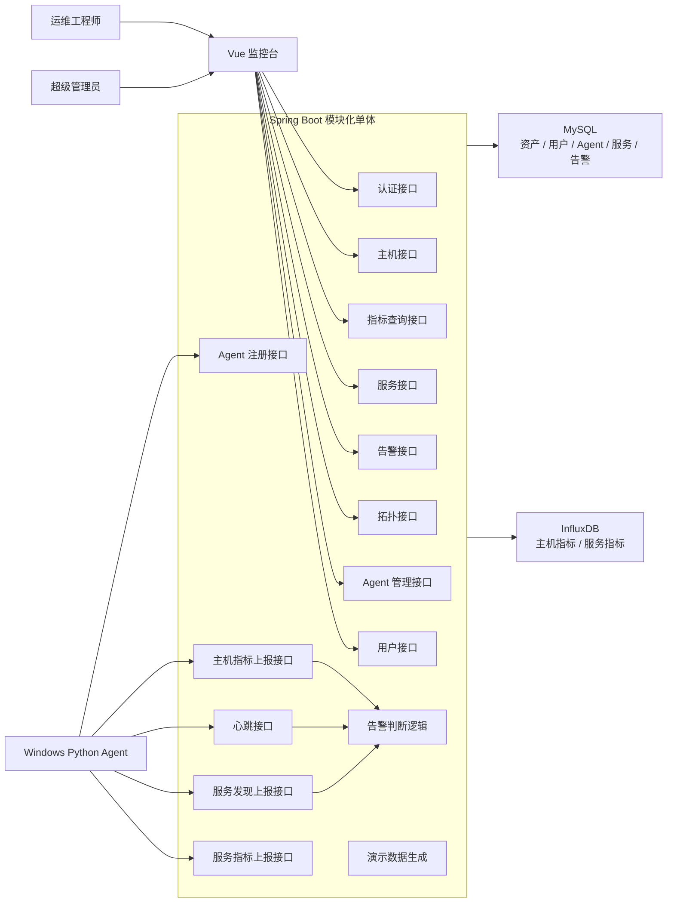
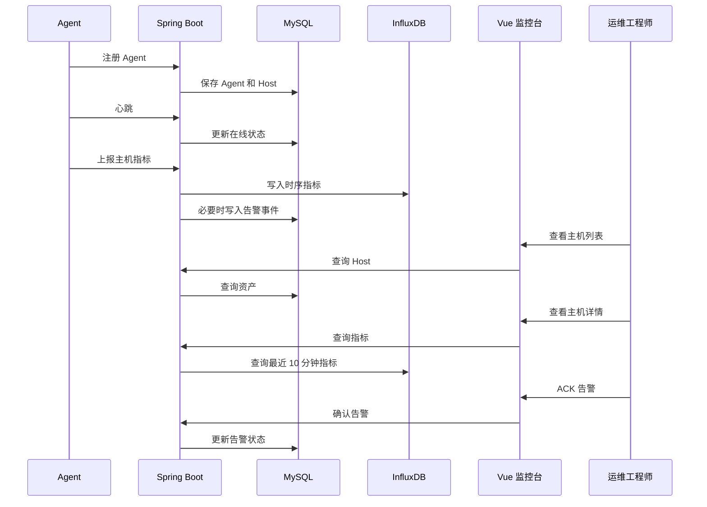
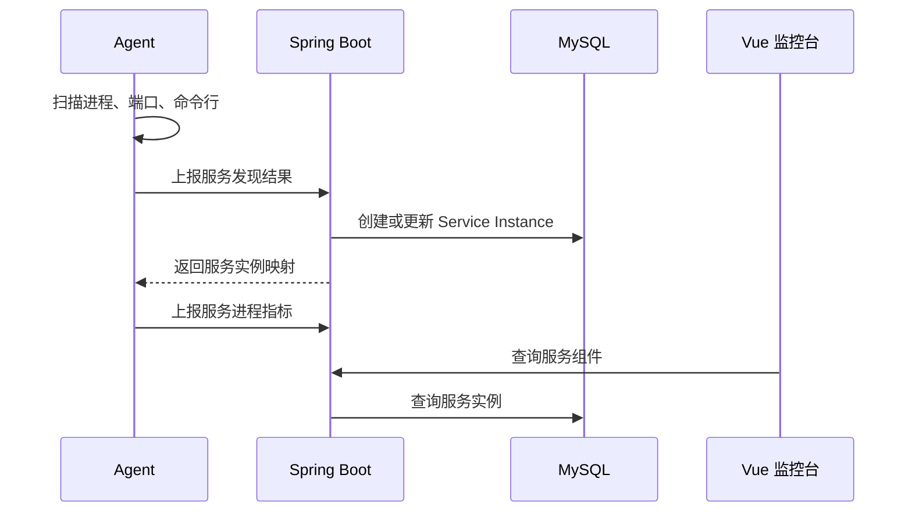

# AegisMonitor 架构复盘

## 1. 复盘目的

本文件按照 `zoom-out` skill 的要求，上升一层抽象，使用 AegisMonitor 的领域词汇梳理系统模块、调用者、调用关系和当前设计风险。目标不是继续增加功能，而是判断当前设计是否已经足够稳定，能否进入主链路 TDD 与编码阶段。

## 2. 领域词汇地图

| 领域词汇 | 含义 | 所属边界 |
| --- | --- | --- |
| Agent | 部署在被监控 Windows 主机上的采集程序 | Agent |
| Host | 被监控主机资产 | 后端 / MySQL |
| Host Metric | CPU、内存、磁盘、网络、TCP 等主机指标 | Agent / InfluxDB |
| Service Instance | Agent 识别出的服务实例 | Agent / 后端 / MySQL |
| Service Metric | 服务进程 CPU、内存、连接数等指标 | Agent / InfluxDB |
| Agent Token | Agent 首次注册使用的接入凭证 | 后端 / MySQL |
| Agent Secret | Agent 注册成功后的上报凭证 | Agent / 后端 |
| Alert Rule | 告警规则，例如 CPU 超过 80% | 后端 / MySQL |
| Alert Event | 由规则触发出的告警事件 | 后端 / MySQL |
| ACK | 运维工程师确认告警 | 前端 / 后端 |
| Service Topology | 服务依赖关系图 | 后端 / 前端 |
| Simulated Trace | 模拟调用链 | 后端 / 前端 |
| Demo Data | 模拟主机、指标、服务和告警 | 后端 / MySQL / InfluxDB |

## 3. 系统模块地图

## 4. 主要调用者与被调用模块

### 4.1 Windows Agent

Agent 是采集侧调用者。

调用目标：

- `POST /api/agents/register`
- `POST /api/agents/heartbeat`
- `POST /api/metrics/host`
- `POST /api/services/report`
- `POST /api/metrics/services`

Agent 不应该调用：

- 用户登录接口。
- 告警确认接口。
- 前端页面接口。

### 4.2 Vue 监控台

Vue 监控台是用户侧调用者。

调用目标：

- 登录与当前用户接口。
- 主机列表与主机详情接口。
- 指标查询接口。
- 服务列表接口。
- 告警规则与告警事件接口。
- 拓扑与模拟调用链接口。
- Agent 管理与用户管理接口。

Vue 不应该调用：

- Agent 本地接口。
- InfluxDB 直连接口。
- MySQL 直连接口。

### 4.3 Spring Boot 后端

Spring Boot 是系统协调者。

下游依赖：

- MySQL：低频关系型数据。
- InfluxDB：高频时序指标。

内部核心职责：

- 身份认证。
- Agent 接入认证。
- 资产状态维护。
- 指标写入和查询。
- 告警规则判断。
- 告警事件状态流转。
- 演示数据生成。

## 5. 主链路地图

### 5.1 最小可演示链路

这条链路是项目的生命线。它跑通以后，AegisMonitor 就已经能证明课题二的核心价值。

### 5.2 服务识别链路

注意：当前接口原型中服务指标上报需要 `serviceId`，但 Agent 初次发现服务时并不知道后端生成的 `serviceId`。因此服务发现上报接口应返回服务实例映射，或者服务指标上报接口改用自然键。

推荐方案：

- `POST /api/services/report` 返回 `serviceKey -> serviceId` 映射。
- Agent 本地缓存映射。
- 服务自然键建议为 `hostId + stackType + pid + primaryPort`。

## 6. 设计整体判断

当前设计总体是通顺的。

强项：

- 项目范围控制得住，明确是课程设计级演示系统。
- `Agent -> 后端 -> 数据库 -> 前端 -> 告警闭环` 主链路清晰。
- MySQL 与 InfluxDB 分工正确，符合监控平台数据特点。
- 服务拓扑和模拟调用链被放在 P2，没有压垮 MVP。
- 演示数据兜底是必要且正确的设计。
- 权限模型有企业味道，但 MVP 只实现两类角色，范围合理。

可以进入下一阶段，但建议先修正若干设计缝隙。

## 7. 需要修正的设计缝隙

### 7.1 服务指标上报缺少 serviceId 映射闭环

问题：

- `POST /api/metrics/services` 要求 Agent 提供 `serviceId`。
- 但 `serviceId` 由后端创建，Agent 仅靠本地扫描无法天然知道。

建议：

- 在服务发现上报响应中返回服务映射。
- 或让服务指标上报使用 `hostId + pid + stackType + port` 自然键，由后端解析到 `serviceId`。

优先级：

- P1，进入详细设计前必须定。

### 7.2 Agent Secret 需要本地持久化策略

问题：

- Agent 注册后获得 `agentSecret`。
- 后续上报需要 `X-Agent-Secret`。
- 当前文档没有说明 Agent 重启后如何保存和复用 secret。

建议：

- Agent 注册成功后写入本地状态文件，例如 `.agent-state.json`。
- 如果状态文件存在，优先使用已有 `agentId/hostId/agentSecret`。
- 如果上报被拒绝，再重新注册。

优先级：

- P0。

### 7.3 监听端口列表不适合高频写入 InfluxDB

问题：

- 主机指标上报中包含 `listeningPorts`。
- 数据模型中又说明监听端口列表不建议高频写入 InfluxDB。

建议：

- `connectionCount` 写入 InfluxDB。
- `listeningPorts` 作为 Host 最新快照写入 MySQL，或只在 Agent 心跳/静态信息补报时更新。

优先级：

- P0。

### 7.4 告警去重需要最小策略

问题：

- 如果 Agent 每 5 秒上报一次 CPU 超阈值，系统可能每 5 秒生成一条重复告警。

建议：

- `alert_events` 增加 `fingerprint` 字段。
- 对同一 `ruleId + targetType + targetId`，若存在 `NEW` 或 `ACKED` 告警，则不重复创建。

优先级：

- P1。

### 7.5 Sprint 2 登录页面依赖 Sprint 3 登录接口

问题：

- `ISSUE-2002 实现登录页面` 依赖 `ISSUE-3001 实现用户登录与 JWT`。
- 这意味着前端 Sprint 2 的登录页会被 Sprint 3 后端认证阻塞。

建议：

- 方案 A：把最小登录/JWT 提前到 Sprint 1 末尾或 Sprint 2 开头。
- 方案 B：Sprint 2 前端先做开发态免登录，Sprint 3 再接入真实登录。

推荐：

- 采用方案 B，避免认证阻塞主机监控展示。

优先级：

- P1。

### 7.6 MySQL 示例中的 PID 与端口要避免混淆

问题：

- 接口原型的 MySQL 服务示例中 `pid` 写成了 `3306`，容易和端口混淆。

建议：

- 后续详细设计和代码中，`pid` 使用真实进程 ID，`ports` 使用端口数组。

优先级：

- P2，文档清理项。

## 8. 模块边界复盘

### 8.1 Agent 边界

Agent 只负责：

- 采集。
- 识别。
- 上报。
- 本地配置。
- 本地状态保存。

Agent 不负责：

- 判断复杂告警。
- 存储历史指标。
- 提供前端访问接口。
- 接收后端远程配置下发。

### 8.2 后端边界

后端负责：

- 接收 Agent 数据。
- 写入 MySQL 和 InfluxDB。
- 提供前端 API。
- 维护资产、服务、告警状态。
- 做最小权限控制。

后端不负责：

- 直接采集主机指标。
- 直接渲染前端页面。
- 生产级高可用。
- 完整 OpenTelemetry Trace。

### 8.3 前端边界

前端负责：

- 展示。
- 筛选。
- 刷新。
- 用户操作。
- 告警 ACK 和关闭。

前端不负责：

- 直接访问数据库。
- 直接访问 Agent。
- 自行计算复杂告警。

## 9. 下一步建议

当前不建议继续新增功能文档。下一步应进入 `tdd` 阶段，但只覆盖 Sprint 1 的最小主链路。

建议 TDD 范围：

1. Agent 配置读取。
2. Agent 注册请求构造。
3. Agent 本地状态保存。
4. 主机指标数据结构转换。
5. 后端 Agent 注册接口。
6. 后端心跳接口。
7. 后端主机指标接收。
8. MySQL 主机/Agent 表写入。
9. InfluxDB 指标写入适配。

暂缓 TDD：

- 服务拓扑。
- 模拟调用链。
- 用户管理页面。
- Agent 纳管页面。
- 完整告警中心 UI。

## 10. 结论

AegisMonitor 的需求、任务、架构、接口、数据和页面原型已经足够进入实现前的 TDD 阶段。

进入编码前必须先修正或明确：

1. 服务发现上报如何返回 `serviceId` 映射。
2. Agent Secret 如何本地持久化。
3. 监听端口列表写入 MySQL 还是只作为快照返回。
4. 告警事件如何做最小去重。

修正这些点后，可以从 Sprint 1 的主链路开始实现。

